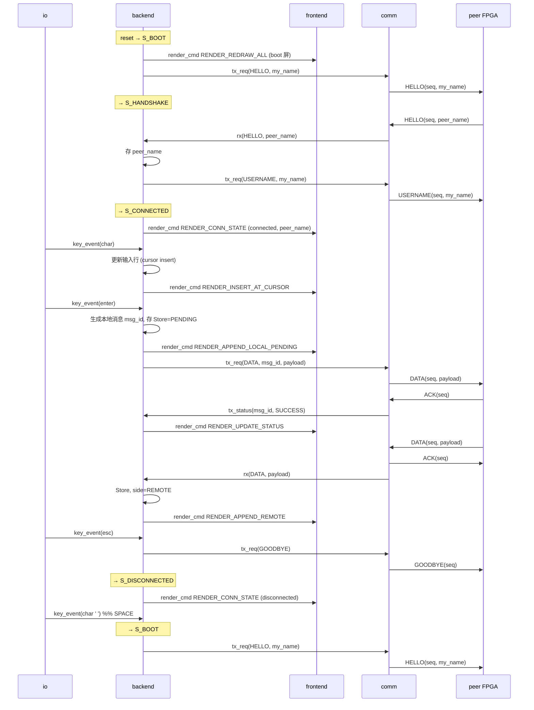
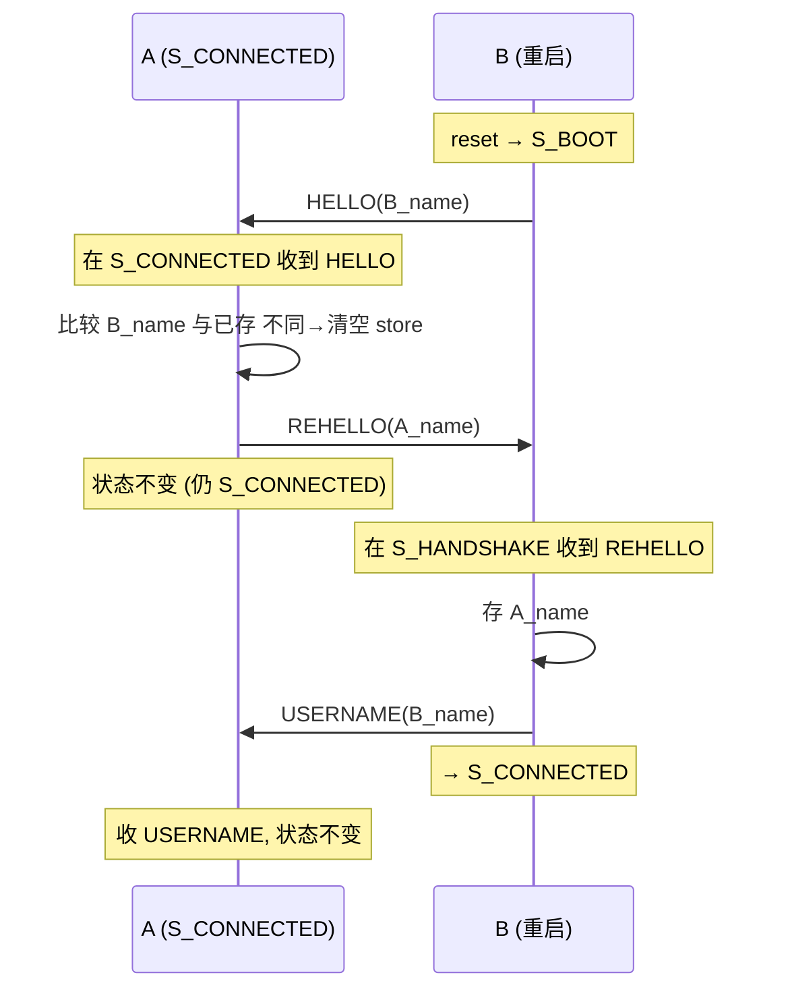
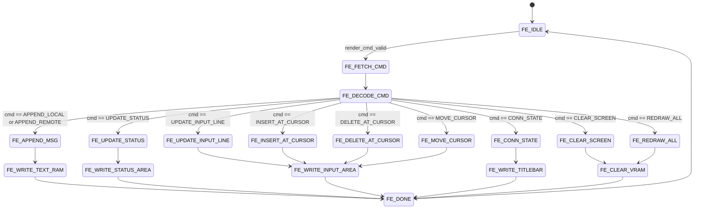
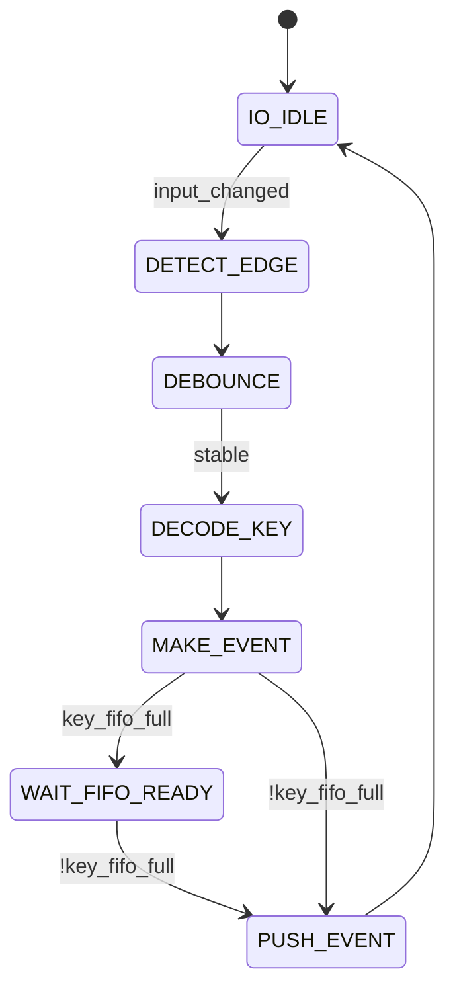
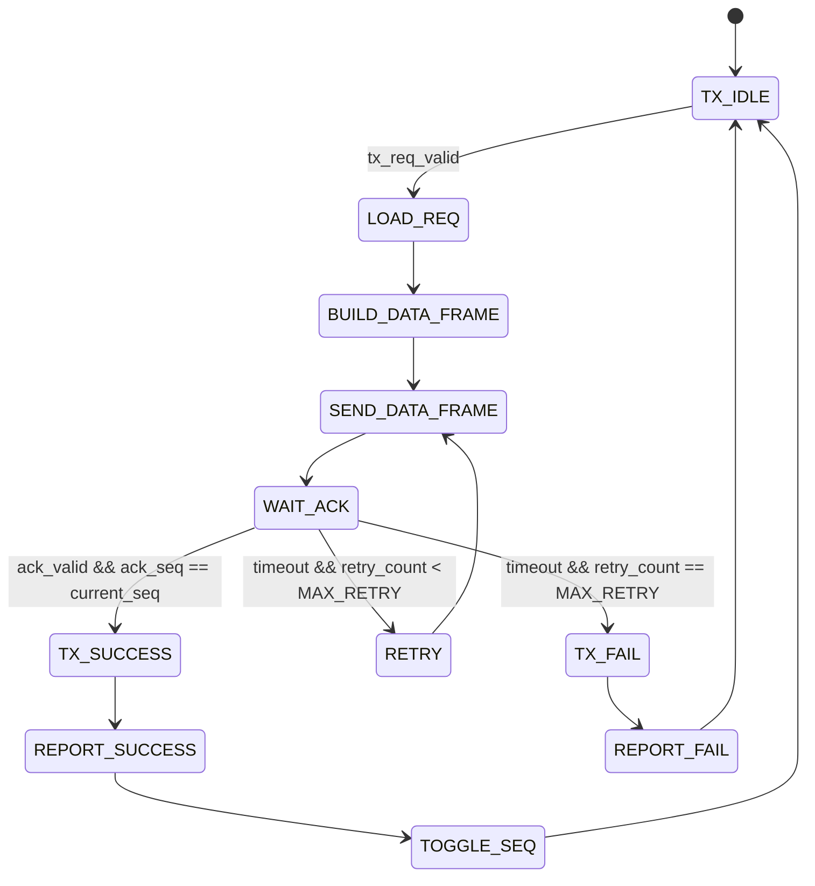
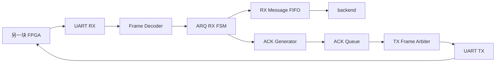
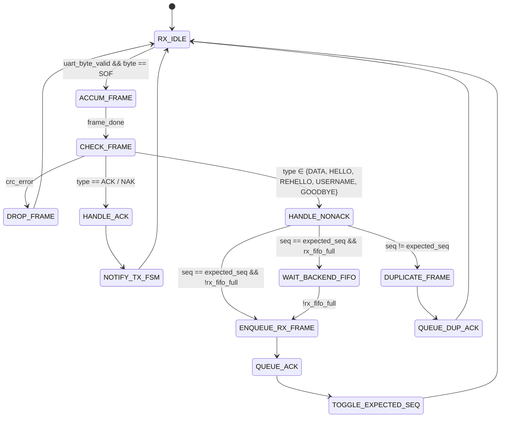
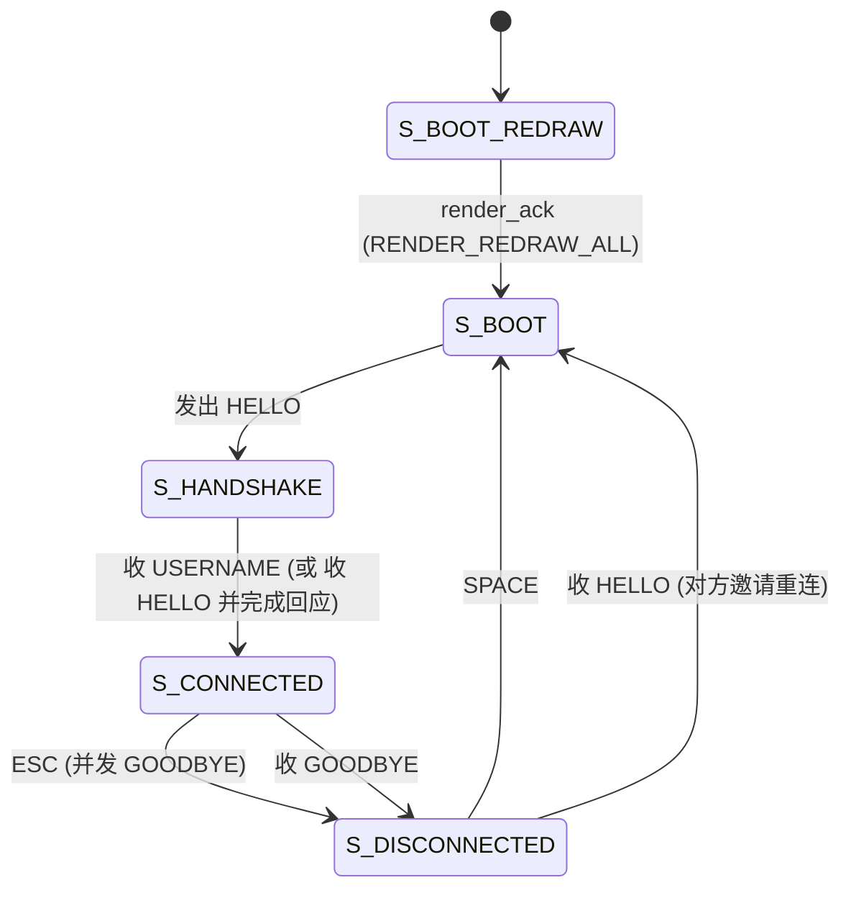
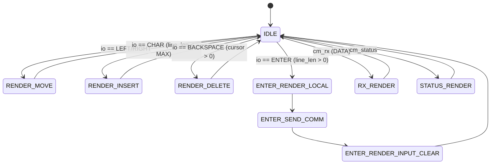

## 数设方案草稿

**注意**: 请使用system verilog完成, 尽量类型清晰, 利于静态检查

### 1. 大纲

**模块设计**:

io (外设交互)

frontend (前端渲染)

comm (通信)

backend (聊天系统核心状态机, 含连接管理)

**大概思路**: (非状态机表述)

io接受输入 -> 向backend发送信号 -> backend通过comm发送信息 -> comm接受信息 -> comm向backend发送信号 -> backend接受信息 -> backend向前端发送新渲染请求

backend 同时管理"连接 / 用户名"的握手流程: 上电向对方索取用户名, 对方回应后进入聊天; ESC 通知对方断开, 双方进 disconnected 屏; SPACE 重新发起握手. 详见 §6 (Backend).

**Backend**

状态机分两层:

**外层 (连接管理)**:

1. 上电 -> 发 HELLO -> 等对方回应 -> 进入 connected
2. connected 中 -> ESC -> 发 GOODBYE -> disconnected; 收到 GOODBYE 同理
3. disconnected -> SPACE 或 收到 HELLO -> 重新走 1

**内层 (聊天主流程, 仅在 connected 下使能)**:

1. io信号 -> 接受io信息 (光标编辑/输入行) -> 前端渲染

2. io信号 (Enter) -> 存本地消息 -> 通过 comm 发送 -> 收到发送结果 (SUCCESS/FAIL) -> 前端渲染

3. comm信号 (DATA) -> 接受远端消息 -> 存信息 -> 前端渲染

其中细节的要实现:

握手与用户名比较 (含 store 清空判定);

发信息;

收信息;

存储;

向前端发信号.

**Comm**

状态机:

后端发送信号 -> 发消息 (不太确定可靠传输要怎么实现) -> 返回结果 (success or fail) 向后端

收到信号 -> 收消息 -> 回复确认消息给对方 -> 如果成功, 向后端发送信号

可靠传输的状态机细节: IDLE, SEND, WAIT_ACK, RETRY, SUCESS, FAIL; IDLE, RECV, CHECK, SEND_ACK, NOTIFY


其中细节的要实现:

把消息按照特定协议编码;

对消息解码;

通知后端

**io**

状态机:

外设改变电平 -> 发消息


**Frontend**

状态机:

后端发送消息信号 -> 渲染消息

后端发送消息发送成功信号 -> 渲染成功或者失败


**锁机制**

注意上述都要实现一个等待锁状态, 当仲裁官判定等待的时候


**程序框图**

(1) 上电握手 + 聊天 + ESC 断开 + SPACE 重连:



(2) mid-chat 时对方重启的处理 (REHELLO 防循环):




### 2. 模块间接口

1. `io -> backend`

传递键盘事件

| 信号                | 方向         | 含义                       |
| ------------------- | ------------ | -------------------------- |
| `io_key_valid`      | io → backend | io 有一个键盘事件          |
| `io_key_ready`      | backend → io | backend 可以接收           |
| `io_key_type[2:0]`  | io → backend | 字符、回车、退格、方向键等 |
| `io_key_ascii[7:0]` | io → backend | ASCII 字符                 |
| `io_key_code[7:0]`  | io → backend | 原始键码，可选             |

事件类型:

```text
KEY_CHAR      = 0
KEY_ENTER     = 1
KEY_BACKSPACE = 2
KEY_LEFT      = 3
KEY_RIGHT     = 4
KEY_ESC       = 5
```

2. `backend -> comm`

用于请求发送一帧 (聊天 DATA, 也包括 HELLO/REHELLO/USERNAME/GOODBYE 控制帧).

| 信号                     | 方向           | 含义                              |
| ------------------------ | -------------- | --------------------------------- |
| `be_tx_valid`            | backend → comm | backend 有帧要发送                |
| `be_tx_ready`            | comm → backend | comm 可以接收发送请求             |
| `be_tx_frame_type[2:0]`  | backend → comm | DATA / HELLO / REHELLO / USERNAME / GOODBYE |
| `be_tx_msg_id[7:0]`      | backend → comm | 仅 DATA 帧使用; 之后用来更新发送状态 |
| `be_tx_len[7:0]`         | backend → comm | payload 长度 (HELLO/REHELLO/USERNAME 用 name_len; GOODBYE=0) |
| `be_tx_payload[...]`     | backend → comm | DATA 时是消息内容; HELLO/REHELLO/USERNAME 时是用户名; GOODBYE 时不用 |

`msg_id` 仅对 DATA 有意义, 控制帧由 backend 视作 fire-and-forget (依赖 comm 的 ARQ 可靠送达, 不通过 `cm_status` 回报). ACK / NAK 由 comm 内部生成, 不走这个接口.

3. `comm -> backend`

分成两类事件：收到远端消息、发送结果返回。

### 收到远端帧

| 信号                     | 方向           | 含义                                            |
| ------------------------ | -------------- | ----------------------------------------------- |
| `cm_rx_valid`            | comm → backend | comm 收到新帧                                   |
| `cm_rx_ready`            | backend → comm | backend 可以接收                                |
| `cm_rx_frame_type[2:0]`  | comm → backend | DATA / HELLO / REHELLO / USERNAME / GOODBYE     |
| `cm_rx_seq[7:0]`         | comm → backend | 对端帧序号                                      |
| `cm_rx_len[7:0]`         | comm → backend | payload 长度 (DATA: 消息长; HELLO 等: 用户名长) |
| `cm_rx_payload[...]`     | comm → backend | DATA 时是消息; HELLO/REHELLO/USERNAME 时是用户名; GOODBYE 时无意义 |

### 发送结果

| 信号                         | 方向           | 含义                 |
| ---------------------------- | -------------- | -------------------- |
| `cm_status_valid`            | comm → backend | 某条消息发送结束     |
| `cm_status_ready`            | backend → comm | backend 可以接收状态 |
| `cm_status_msg_id[7:0]`      | comm → backend | 对应本地消息 ID      |
| `cm_status_code[1:0]`        | comm → backend | SUCCESS / FAIL       |
| `cm_status_retry_count[3:0]` | comm → backend | 重传次数，可选       |

状态码：

```text
TX_SUCCESS = 0
TX_FAIL    = 1
```

4.  `backend -> frontend`

backend 向 frontend 发送渲染命令

| 信号                          | 方向               | 含义                                            |
| ----------------------------- | ------------------ | ----------------------------------------------- |
| `be_render_valid`             | backend → frontend | backend 有渲染命令                              |
| `be_render_ready`             | frontend → backend | frontend 可以接收                               |
| `be_render_cmd[3:0]`          | backend → frontend | 渲染命令类型                                    |
| `be_render_msg_id[7:0]`       | backend → frontend | APPEND_LOCAL/APPEND_REMOTE/UPDATE_STATUS 用     |
| `be_render_side[1:0]`         | backend → frontend | 本地消息 / 远端消息 / 系统消息                  |
| `be_render_status[1:0]`       | backend → frontend | pending / success / fail                        |
| `be_render_len[7:0]`          | backend → frontend | 文本长度 (消息或输入行)                         |
| `be_render_payload[...]`      | backend → frontend | 文本内容 (消息或输入行)                         |
| `be_render_cursor_pos[7:0]`   | backend → frontend | 编辑后光标位置 (MOVE/INSERT/DELETE/UPDATE_INPUT) |
| `be_render_ascii[7:0]`        | backend → frontend | INSERT_AT_CURSOR 时新插入的字符                  |
| `be_render_conn_state[1:0]`   | backend → frontend | boot / handshake / connected / disconnected     |
| `be_render_peer_name_len[7:0]`| backend → frontend | 对端用户名长度 (CONN_STATE / REDRAW_ALL 用)     |
| `be_render_peer_name[...]`    | backend → frontend | 对端用户名 (16 byte)                            |

渲染命令:

```text
RENDER_APPEND_LOCAL_PENDING = 0    // 新增本地 pending 消息
RENDER_APPEND_REMOTE        = 1    // 新增远端消息
RENDER_UPDATE_STATUS        = 2    // 更新某条本地消息状态
RENDER_UPDATE_INPUT_LINE    = 3    // 整行刷新输入区 (清空/REDRAW 配合)
RENDER_CLEAR_SCREEN         = 4    // 清屏
RENDER_REDRAW_ALL           = 5    // 全屏重画 (boot 后, 切换 conn_state 配合)
RENDER_MOVE_CURSOR          = 6    // 仅光标移动
RENDER_INSERT_AT_CURSOR     = 7    // 在光标位置插入一字符
RENDER_DELETE_AT_CURSOR     = 8    // 删除光标左一字符
RENDER_CONN_STATE           = 9    // 连接状态切换 (含 peer_name)
```

### 3. Frontend设计

frontend 只处理 backend 发来的渲染命令, 状态机如下



frontend 内部根据 `conn_state` 决定全局画面布局; 不同的连接状态对应 4 种屏:

```text
boot 屏:                            handshake 屏:
+--------------------------------+   +--------------------------------+
|   Chat (booting...)            |   |   Connecting to peer...        |
+--------------------------------+   +--------------------------------+

connected 屏 (主聊天):              disconnected 屏:
+--------------------------------+   +--------------------------------+
| Chat with: peer_name           |   |   Disconnected.                |
|                                |   |   Press SPACE to reconnect.    |
| peer: hello                    |   |                                |
| me:   hi😘            [✅]     |   |                                |
| me:   are you there?  [❗️]     |   |                                |
|                                |   |                                |
+--------------------------------+   +--------------------------------+
| Input: current typing line   _ |   +--------------------------------+
+--------------------------------+
```

`RENDER_CONN_STATE` 命令带 `conn_state` (boot/handshake/connected/disconnected) 与 (仅 connected 时) `peer_name`. frontend 据此重画顶栏/全屏布局.

### 4. IO 设计

io 负责把外部电平变化转换为标准事件, 状态机如下:



注意:

- 外部按键是异步信号, 必须同步;
- 机械按键需要消抖;
- PS/2 键盘需要扫描码解码, UART 输入设备则需要 UART RX 解码.

### 5. Comm 设计

(1) 通信协议设计

当前设计, 一次只发一帧, 等 ACK, 超时重传.

帧种类:

```text
DATA       聊天消息
ACK        ARQ 确认
NAK        ARQ 否定确认 (可选)
HELLO      "我刚 boot/重连, 我是 X"   (payload = 自己的用户名)
REHELLO    "我也想知道你是谁, 但你别再问我了"   (payload = 自己的用户名)
USERNAME   "我是 X" (回应)            (payload = 自己的用户名)
GOODBYE    "我要断开"                 (payload 为空)
```

帧格式:

```text
+------+-------+------+--------+---------+-------+
| SOF  | TYPE  | SEQ  | LEN    | PAYLOAD | CRC16 |
+------+-------+------+--------+---------+-------+
  8b     3b      8b     8b       N bytes   16b
```

字段含义:

| 字段      | 含义                                                   |
| --------- | ------------------------------------------------------ |
| `SOF`     | 帧起始标志, 例如 `0x7E`                                |
| `TYPE`    | `DATA / ACK / NAK / HELLO / REHELLO / USERNAME / GOODBYE` |
| `SEQ`     | 序号, 用于 ACK 和去重                                  |
| `LEN`     | payload 长度 (DATA 时是消息长; HELLO/REHELLO/USERNAME 时是用户名长; ACK/NAK/GOODBYE 时为 0) |
| `PAYLOAD` | DATA 时是聊天消息; HELLO/REHELLO/USERNAME 时是用户名; ACK/NAK/GOODBYE 时不存在 |
| `CRC16`   | 校验码                                                 |

ACK / NAK / GOODBYE 没有 payload:

```text
+------+-------+------+-------+
| SOF  | TYPE  | SEQ  | CRC16 |
+------+-------+------+-------+
```

**ARQ 范围**: DATA 和所有控制帧 (HELLO/REHELLO/USERNAME/GOODBYE) 都走 ARQ, 由 comm 内部统一处理. ACK/NAK 自身不走 ARQ.

(2) 发送状态机

发送状态机:



相关寄存器:

```text
current_seq
retry_count
timeout_counter
current_msg_id
current_payload
current_len
```

(3) 接收状态机



接收状态机:



注: 链路层不区分 DATA 和控制帧, 全部由 ARQ 统一处理. 帧类型只在 backend 接口侧透传 (`cm_rx_frame_type`).

**注意**:

收到重复帧 (DATA / HELLO / REHELLO / USERNAME / GOODBYE) 时, 要重新发送 ACK, 但不要重复交给 backend. 因为对方可能已经发送成功了, 只是 ACK 在路上丢了, 所以它重传了原帧. 应该帮它补 ACK, 但不能让聊天窗口出现两条一样的消息, 也不能让 backend 重复处理握手.

(4) comm 内部仲裁

comm 内部至少有两类东西要发:

1. backend 请求发送的 DATA / HELLO / REHELLO / USERNAME / GOODBYE 帧 (走 ARQ);
2. 接收端需要回复的 ACK / NAK 帧 (不走 ARQ).

优先级: ACK > 其它

### 6. Backend 设计

backend 是核心控制器, 同时承担两件事:

- **连接管理 FSM** (外层): 上电握手 / 用户名交换 / ESC-GOODBYE / SPACE 重连
- **聊天 FSM** (内层, 仅在 `S_CONNECTED` 下使能): 输入行编辑 / 消息发送与确认 / 消息接收

(1) 连接管理 FSM (外层)



`S_BOOT` 是个单周期 launcher 状态: 一进来就向 comm 发 HELLO 帧 (载荷 = 自己用户名), 然后转 `S_HANDSHAKE`.

收到帧的反应表 (覆盖所有外层状态):

| 收到帧       | S_BOOT / S_HANDSHAKE                | S_CONNECTED                                | S_DISCONNECTED                          |
|--------------|-------------------------------------|--------------------------------------------|------------------------------------------|
| `HELLO`      | 比较+存用户名, 发 USERNAME, → S_CONNECTED | 比较+存用户名, 发 REHELLO, 状态不变        | 比较+存用户名, 发 USERNAME, → S_CONNECTED |
| `REHELLO`    | 比较+存用户名, 发 USERNAME, → S_CONNECTED | 比较+存用户名, 发 USERNAME, 不变            | 比较+存用户名, 发 USERNAME, 不变           |
| `USERNAME`   | 比较+存用户名, → S_CONNECTED         | 比较+存用户名, 不变                        | 比较+存用户名, 不变                       |
| `GOODBYE`    | 忽略                                 | → S_DISCONNECTED                            | 忽略                                      |
| `DATA`       | 忽略                                 | 走聊天 FSM 接收流程                         | 忽略                                      |

**比较+存用户名** 的语义: 跟内部 `peer_name_q / peer_name_len_q` 比较, 不同 → 把整个 message_store 清空, 然后用新用户名替换 (LOCAL 也清, 上下文已失效); 相同 → 仅刷新; 首次收到 (`peer_name_valid_q == 0`) → 只存, 不算切换不清空.

**REHELLO 的作用**: HELLO 在 mid-chat 时不能直接回 USERNAME (那样对方不知道我是 in-chat 状态), 但也不能再发 HELLO (对方又会发 REHELLO 给我, 死循环). REHELLO 的契约就是 "终止索取链" — 收到 REHELLO 一律只回 USERNAME, 永远不再发 REHELLO/HELLO.

按键事件 (与帧事件并行, 由仲裁优先级 `cm_status > cm_rx > io_key` 选择):

| io 事件                  | S_BOOT / S_HANDSHAKE | S_CONNECTED                       | S_DISCONNECTED                  |
|--------------------------|----------------------|-----------------------------------|---------------------------------|
| `KEY_CHAR` (非 SPACE)    | 丢弃                  | 走聊天 FSM (光标插入)               | 丢弃                             |
| `KEY_CHAR` ascii=`' '`   | 丢弃                  | 走聊天 FSM (输入空格字符)           | → S_BOOT (重连)                  |
| `KEY_BACKSPACE/LEFT/RIGHT/ENTER` | 丢弃          | 走聊天 FSM                          | 丢弃                             |
| `KEY_ESC`                | 丢弃                  | 发 GOODBYE → S_DISCONNECTED        | 丢弃                             |

(2) 聊天 FSM (内层, 仅在 S_CONNECTED 下运行)

这部分维持现有实现 (cursor 编辑, store 写入, render 仲裁等), 见 `rtl/backend/be_top.sv`. 关键状态:



事件仲裁优先级在 IDLE 下: `cm_status > cm_rx > io_key` (与现有实现一致). 边界保护: line buffer 满时丢 CHAR; cursor 在 0 时 LEFT 不动也不渲染; cursor==len 时 RIGHT 同样.

(3) 需要维护的数据结构

(3.1) 连接相关

```text
conn_state_q          // S_BOOT_REDRAW / S_BOOT / S_HANDSHAKE / S_CONNECTED / S_DISCONNECTED
peer_name_q[0:MAX_NAME_LEN-1]  // 对端用户名 (ASCII)
peer_name_len_q       // 对端用户名长度
peer_name_valid_q     // 是否已收到过用户名 (用于首次连接 vs 切换的判定)
```

(3.2) 当前输入行缓冲

```text
line_buf[0:MAX_LINE_LEN-1]
line_len_q
cursor_pos_q          // 0..line_len_q
```

支持: 普通字符在光标处插入, Backspace 在光标左侧删除, LEFT/RIGHT 移动光标, Enter 发送 (带空行守卫).

(3.3) 聊天记录存储

```text
message_store[i] = {
    valid,
    msg_id,
    side,      // LOCAL / REMOTE / SYSTEM
    status,    // PENDING / SUCCESS / FAIL
    len,
    payload
}
```

切换到新对端用户名时, 整片 store 被清空 (所有 entry valid=0).

参数设置:

```text
MAX_MSG_NUM   = 64
MAX_MSG_LEN   = 64
MAX_NAME_LEN  = 16
MSG_ID_WIDTH  = 8
```

(4) 边界与并发说明

- HELLO 在 ARQ 层一直重传到对方应答, 所以 backend 不需要为 "对方还没启动" 做超时. 任何状态下收到 HELLO 都触发响应, 自然处理 "对方先启动 / 我先启动 / 对方重启" 三种 race.
- ESC 在 S_CONNECTED 才有意义; 先发 GOODBYE (走 ARQ, 保证对方收到) 再切到 S_DISCONNECTED, 不等回执. 即使对方 GOODBYE 没及时收到, 下次任意一方发 HELLO 时, 双方状态会自然对齐.
- ESC 之后 store 不立即清空; 重连时由 "比较+存用户名" 逻辑决定是否清空 (同一对端 → 保留历史; 新对端 → 清空).

### 7. 外设相关

1. 输入外设 (PS/2 键盘)

2. 显示外设 (HDMI)

### 8. 用户名配置

每块 FPGA 的用户名编译时硬编码在顶层 `chat_top.sv` 内. SV 模块的 `parameter` 机制允许参数化 (类似 C 模板), 实例化时传值; 这里直接放在 `chat_top` 顶部作为 `localparam`, A 板和 B 板各自 build 不同 bitstream:

```systemverilog
// rtl/chat_top.sv (示意, 后续编写)
module chat_top (
    input  logic clk,
    input  logic rst_n,
    inout  logic ps2_clk,
    inout  logic ps2_data,
    output logic uart_tx,
    input  logic uart_rx,
    /* HDMI pins ... */
);
    // 这块板子的身份, build 时按板修改
    localparam int MY_NAME_LEN = 5;
    localparam logic [7:0] MY_NAME [0:chat_pkg::MAX_NAME_LEN-1] =
        '{"A","l","i","c","e", default: 8'h00};
    /* ... 实例化 io_top / be_top / comm_top / fe_top 并把 MY_NAME / MY_NAME_LEN 透传给 be_top ... */
endmodule
```

后续若要支持运行时配置 (如读拨码开关 → ROM lookup), 可在 chat_top 里把 MY_NAME 换成寄存器, 接口不变.
