# FPGA 双端聊天系统

两块 FPGA 通过 UART 链路通信, 各自接 PS/2 键盘 + HDMI 显示器, 实现一对一文字聊天.

目录结构:

```text
rtl/
  pkg/               chat_pkg.sv, fe_pkg.sv     -- 全局类型/参数
  common/            crc16, sync_2ff, debouncer, handshake_fifo
  io/                PS/2 phy + 解码 + 事件 FIFO
  comm/              UART + 帧编解码 + ARQ FSM + 仲裁
  backend/           聊天主控 (连接管理 + 输入/收发/存储)
  frontend/          render decoder + text_ram + scan + glyph_rom
  chat_top.sv        Verilator/仿真顶层 (无 HDMI 编码)
  chat_top_board.sv  Vivado 板级顶层 (ip_pll + ip_rgb2dvi)
sim/tb/              每个模块的 Verilator testbench
scripts/             gen_font.py, frame_codec.py, crc16_ref.py, run_test.py
constraints/         chat_top_board.xdc (Genesys 2 / xc7a200t)
vivado/              build.tcl, ip_repo
```

---

## 1. 系统框图 (端到端时序)

(1) 上电握手 + 聊天 + ESC 断开 + SPACE 重连:

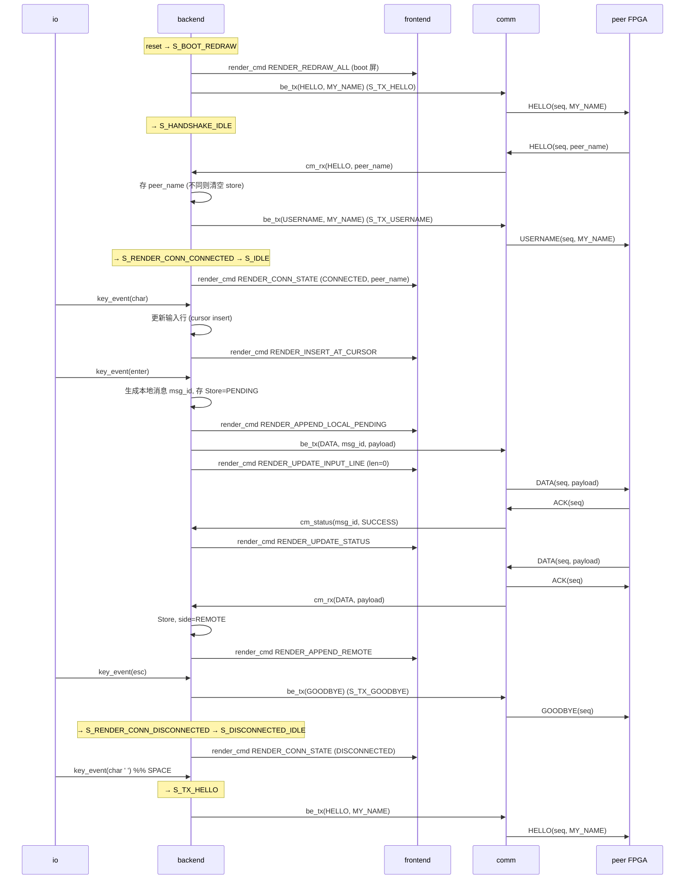

(2) mid-chat 时对方重启的处理 (REHELLO 防循环):

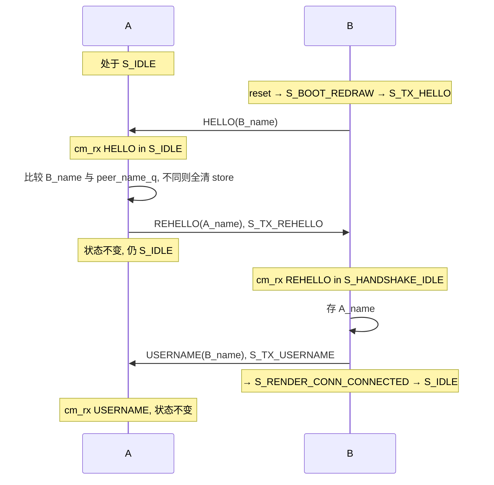

两块板各自编译, 通过 `MY_NAME_LEN` / `MY_NAME_PACKED` 参数把用户名硬编码进 bitstream. 链路层是单根 UART 双工对接, 上层走 stop-and-wait ARQ.

`chat_top_board.sv` 在 `chat_top.sv` 之上叠了两个 Xilinx IP:

- `ip_pll`: 100 MHz → 40 MHz pixel clock (800×600 @ 60 Hz)
- `ip_rgb2dvi`: RGB888 + sync → HDMI TMDS 差分对

`chat_top.sv` 本身只输出 RGB+sync+DE, 没有 TMDS 编码, 这样 Verilator 能直接 elaborate 整个 chat_top 做集成测试.

### SRAM 上传背景与头像

Xilinx 实验板的 4MB BaseRAM 现在作为只读视觉素材区使用。先用脚本把图片打包成控制面板可直接写入的 raw binary：

```bash
python3 scripts/gen_sram_assets.py \
  --background path/to/background.png \
  --local-avatar path/to/me.png \
  --remote-avatar path/to/peer.png \
  --out chat_assets.bin
```

然后在实验板控制面板中把 `chat_assets.bin` 从 SRAM 字节地址 `0x0` 写入。控制面板写 SRAM 时会复位实验 FPGA；写完后需要重新下载本工程 bitstream。素材格式和地址布局：

```text
0x000000  800x600 RGB565 background, little-endian, 960000 bytes
0x0EA600  16x16 RGB565 local avatar, little-endian, 512 bytes
0x0EA800  16x16 RGB565 remote avatar, little-endian, 512 bytes
```

前端在 CONNECTED 页面读取 SRAM：聊天历史区背景使用上传背景，远端气泡左侧和本地气泡右侧显示对应头像。标题栏和输入栏仍保留固定配色，保证文字可读。

---

## 2. 子系统 (顶层模块)

| 模块            | 文件                              | 作用                                                  |
| --------------- | --------------------------------- | ----------------------------------------------------- |
| `io_top`        | `rtl/io/io_top.sv`                | PS/2 解码 → key event FIFO                            |
| `be_top`        | `rtl/backend/be_top.sv`           | 连接管理 + 聊天 FSM + 消息存储                         |
| `comm_top`      | `rtl/comm/comm_top.sv`            | UART 收发 + 帧编解码 + ARQ + ACK 仲裁                  |
| `fe_top`        | `rtl/frontend/fe_top.sv`          | render decoder + text_ram + 像素 scan + glyph_rom      |
| `chat_top`      | `rtl/chat_top.sv`                 | 四子系统互联 + reset sync                              |
| `chat_top_board`| `rtl/chat_top_board.sv`           | 板级: ip_pll + chat_top + ip_rgb2dvi                   |

---

## 3. 模块间接口

所有跨模块接口都遵循 `valid / ready` 握手. 类型/常量定义在 `rtl/pkg/chat_pkg.sv`.

### 3.1 `io_top → be_top` (键盘事件)

| 信号                  | 方向          | 含义                              |
| --------------------- | ------------- | --------------------------------- |
| `io_key_valid`        | io → backend  | 有键盘事件                        |
| `io_key_ready`        | backend → io  | backend 可接收                    |
| `io_key_type[2:0]`    | io → backend  | `key_type_e`                      |
| `io_key_ascii[7:0]`   | io → backend  | KEY_CHAR 时的 ASCII; 其他类型忽略 |

`key_type_e` (`chat_pkg.sv`):

```text
KEY_CHAR      = 0    KEY_LEFT     = 3
KEY_ENTER     = 1    KEY_RIGHT    = 4
KEY_BACKSPACE = 2    KEY_ESC      = 5
KEY_UP        = 6    KEY_DOWN     = 7    // 历史滚动
```

### 3.2 `be_top → comm_top` (TX 请求)

发送一帧, 类型可以是 DATA 或四种控制帧 (HELLO / REHELLO / USERNAME / GOODBYE).

| 信号                       | 方向            | 含义                              |
| -------------------------- | --------------- | --------------------------------- |
| `be_tx_valid`              | backend → comm  | backend 要发一帧                  |
| `be_tx_ready`              | comm → backend  | comm 空闲, 可接                   |
| `be_tx_frame_type[2:0]`    | backend → comm  | `frame_type_e`                    |
| `be_tx_msg_id[7:0]`        | backend → comm  | 仅 DATA 用; 用于状态回报          |
| `be_tx_len[7:0]`           | backend → comm  | payload 字节数                    |
| `be_tx_payload[MAX*8-1:0]` | backend → comm  | DATA 内容 / 用户名 / 空           |

`frame_type_e`:

```text
FRAME_DATA     = 0   FRAME_HELLO    = 3
FRAME_ACK      = 1   FRAME_REHELLO  = 4
FRAME_NAK      = 2   FRAME_USERNAME = 5
                     FRAME_GOODBYE  = 6
```

所有 backend 发出的帧都走 ARQ (重传到 MAX_RETRY=4 次), 只有 DATA 帧会经由 `cm_status_*` 回报最终结果, 其它控制帧是 fire-and-forget.

### 3.3 `comm_top → be_top` (RX 帧 + TX 状态)

收到的远端帧:

| 信号                       | 方向            | 含义                       |
| -------------------------- | --------------- | -------------------------- |
| `cm_rx_valid`              | comm → backend  | 收到一帧                   |
| `cm_rx_ready`              | backend → comm  | backend 可消化             |
| `cm_rx_frame_type[2:0]`    | comm → backend  | 与 be_tx_frame_type 同表   |
| `cm_rx_seq[7:0]`           | comm → backend  | 对端帧序号                 |
| `cm_rx_len[7:0]`           | comm → backend  | payload 字节数             |
| `cm_rx_payload[MAX*8-1:0]` | comm → backend  | 帧载荷 (长度 ≤ MAX_MSG_LEN)|

ACK / NAK 由 comm 自己消化, 不上送 backend.

DATA 帧的最终发送状态:

| 信号                     | 方向            | 含义                          |
| ------------------------ | --------------- | ----------------------------- |
| `cm_status_valid`        | comm → backend  | 某条 DATA 已收到 ACK 或超时失败 |
| `cm_status_ready`        | backend → comm  | backend 可接                  |
| `cm_status_msg_id[7:0]`  | comm → backend  | 对应 backend 给的 msg_id      |
| `cm_status_code[1:0]`    | comm → backend  | `TX_SUCCESS=0` / `TX_FAIL=1`  |

### 3.4 `be_top → fe_top` (渲染命令)

| 信号                              | 方向                | 含义                                          |
| --------------------------------- | ------------------- | --------------------------------------------- |
| `be_render_valid`                 | backend → frontend  | 有渲染命令                                    |
| `be_render_ready`                 | frontend → backend  | frontend 可接                                 |
| `be_render_cmd[3:0]`              | backend → frontend  | `render_cmd_e`                                |
| `be_render_msg_id[7:0]`           | backend → frontend  | APPEND/UPDATE_STATUS 时用                     |
| `be_render_side[1:0]`             | backend → frontend  | LOCAL / REMOTE / SYSTEM                       |
| `be_render_status[1:0]`           | backend → frontend  | PENDING / SUCCESS / FAIL                      |
| `be_render_len[7:0]`              | backend → frontend  | payload 长度                                  |
| `be_render_payload[MAX*8-1:0]`    | backend → frontend  | 消息文本 / 输入行                             |
| `be_render_cursor_pos[7:0]`       | backend → frontend  | 编辑后的光标位置                              |
| `be_render_ascii[7:0]`            | backend → frontend  | INSERT_AT_CURSOR 时刚插入的字符               |
| `be_render_conn_state[1:0]`       | backend → frontend  | `conn_state_e`                                |
| `be_render_peer_name_len[7:0]`    | backend → frontend  | 对端用户名长度                                |
| `be_render_peer_name[NAME*8-1:0]` | backend → frontend  | 对端用户名 (16 字节定长)                      |

`render_cmd_e`:

```text
RENDER_APPEND_LOCAL_PENDING = 0    RENDER_REDRAW_ALL       = 5
RENDER_APPEND_REMOTE        = 1    RENDER_MOVE_CURSOR      = 6
RENDER_UPDATE_STATUS        = 2    RENDER_INSERT_AT_CURSOR = 7
RENDER_UPDATE_INPUT_LINE    = 3    RENDER_DELETE_AT_CURSOR = 8
RENDER_CLEAR_SCREEN         = 4    RENDER_CONN_STATE       = 9
                                   RENDER_SCROLL_UP        = 10
                                   RENDER_SCROLL_DOWN      = 11
```

`conn_state_e`:

```text
CONN_BOOT         = 0   CONN_CONNECTED    = 2
CONN_HANDSHAKE    = 1   CONN_DISCONNECTED = 3
```

### 3.5 关键尺寸参数 (`chat_pkg.sv`)

```text
MAX_MSG_LEN  = 64    // 每条消息字节数
MAX_MSG_NUM  = 64    // 历史消息环大小
MAX_LINE_LEN = 64    // 当前输入行长度
MAX_NAME_LEN = 16    // 用户名长度
MAX_RETRY    = 4     // ARQ 最大重传
```

---

## 4. IO 子系统

`io_top` = `io_ps2_phy` → `io_ps2_decoder` → `handshake_fifo` → backend.

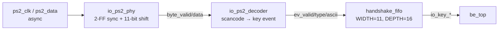

**io_ps2_phy**: PS/2 帧 `start(0) | d0..d7 | parity_odd | stop(1)`. 在 ps2_clk 下降沿采样 ps2_data, 凑齐 11 bit 后做起始位 / 校验 / 停止位检查, 通过则脉冲 `byte_valid`. PS/2 ~10–16 kHz, 输入两个 pin 都先过 `sync_2ff`.

**io_ps2_decoder**: 解释 Set-2 扫描码. 维护三个 sticky 状态:

- `shift_held_q`: Shift make/release (0x12 / 0x59)
- `caps_locked_q`: CapsLock make toggle (0x58)
- `seen_e0_q`, `seen_f0_q`: 前缀字节标志

字母使用 `shift XOR caps`, 其他键只看 shift. 扩展键 (方向键 / Home / End ...) 都带 E0 前缀, 当前实现支持 LEFT / RIGHT / UP / DOWN.

事件输出表:

| 输入                  | 产生事件         | ASCII             |
| --------------------- | ---------------- | ----------------- |
| 字母 / 数字 / 符号    | `KEY_CHAR`       | 标准 ASCII (含大小写) |
| 0x5A                  | `KEY_ENTER`      | -                 |
| 0x66                  | `KEY_BACKSPACE`  | -                 |
| 0x76                  | `KEY_ESC`        | -                 |
| 0xE0 0x6B / 0x74      | `KEY_LEFT/RIGHT` | -                 |
| 0xE0 0x75 / 0x72      | `KEY_UP/DOWN`    | -                 |

任何 release 序列 (0xF0 ...) 和未映射字节都被静默丢弃.

io 状态机非常浅 (phy 是计数+移位, decoder 是 prefix tracker), 整体行为可以总结为:

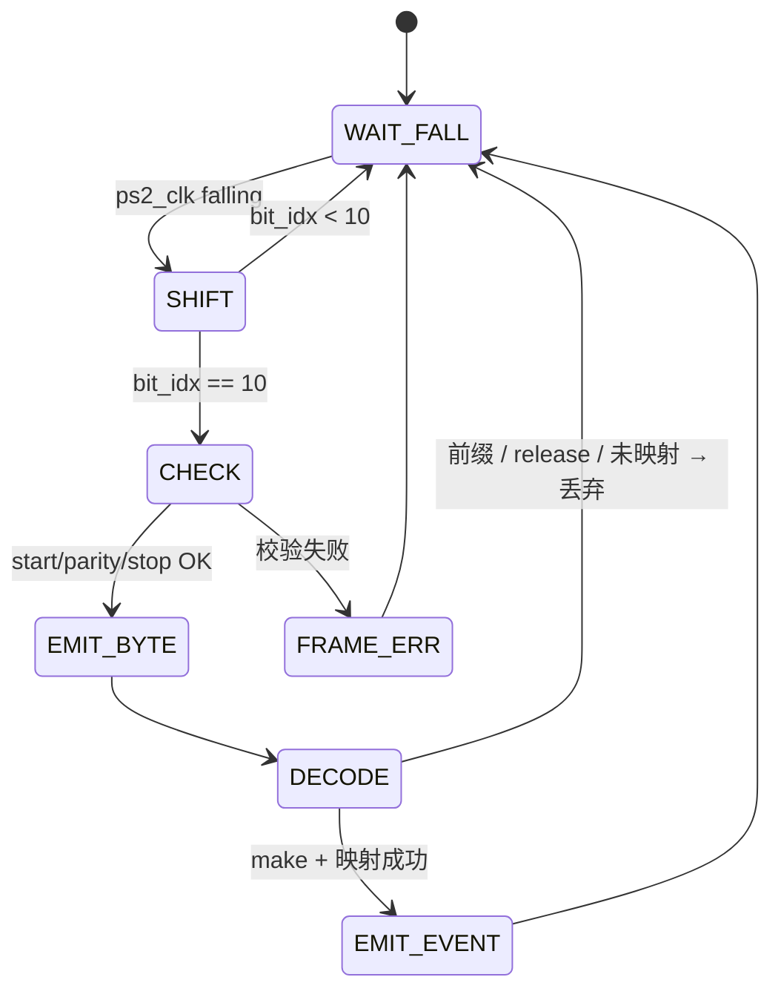

---

## 5. Comm 子系统

`comm_top` 把链路层拆成 RX / TX 两路, 中间靠 ACK 队列连起来.

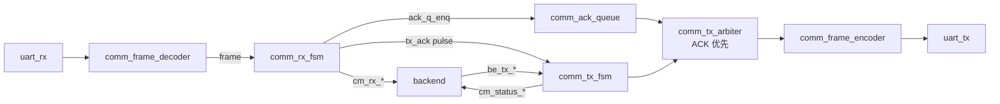

### 5.1 帧格式

```text
+------+------+------+------+----------+--------+--------+
| SOF  | TYPE | SEQ  | LEN  | PAYLOAD  | CRC_HI | CRC_LO |
+------+------+------+------+----------+--------+--------+
 8 bit  3 bit  8 bit  8 bit   LEN byte   8 bit    8 bit
```

- `SOF = 0x7E`, 固定起始字节. 无字节填充 (payload 中允许 0x7E, 靠 LEN 定边界).
- `TYPE` 3 bit, 高 5 bit 在编码时被零填充为完整字节.
- `CRC16` CCITT, 多项式 `0x1021`, 初值 `0xFFFF`, 校验范围 = TYPE..PAYLOAD (不含 SOF 与 CRC 本身), 大端发送.
- 控制帧 (HELLO / REHELLO / USERNAME) 用 payload 携带发送方用户名; ACK / NAK / GOODBYE 的 LEN=0, 无 payload.

### 5.2 TX FSM (stop-and-wait, alternating bit)

`comm_tx_fsm` 只用 SEQ 的最低位 (`tx_seq_q[0]`) 做交替位. SUCCESS 时翻转, FAIL 时不翻转 (因为对端的 expected 也没动).

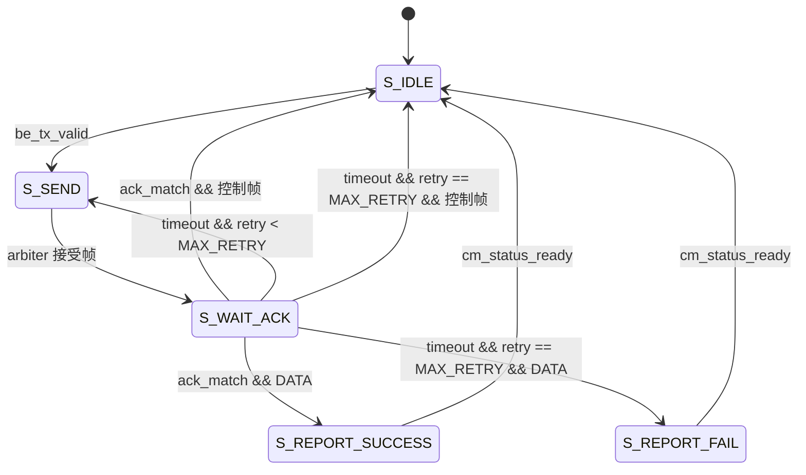

控制帧成功后不上报 (fire-and-forget), 失败也不上报 — 上层不为之做任何 retry/超时逻辑, 双方靠 HELLO 的反复重发自然收敛.

`TIMEOUT_CYCLES` 默认 `2_000_000` (100 MHz × 20 ms). testbench 用更小值缩短仿真.

### 5.3 RX FSM

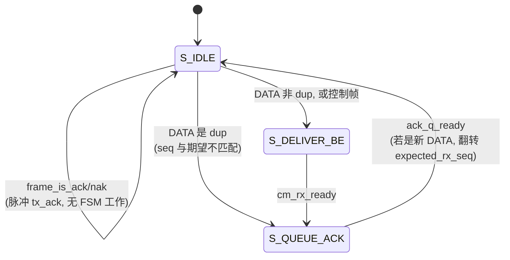

- DATA 用交替位过滤重复, 同 seq 重复包只补 ACK, 不上送 backend.
- 控制帧不查交替位 (对方可能刚重启, seq 已被复位), 始终上送 + 补 ACK. 由 backend 的"比较 + 存用户名"逻辑保证幂等.
- CRC 错误 / LEN 超限 / 未知 type 都在更早环节静默丢弃 (decoder `drop_pulse` 给 sim 观测).

### 5.4 TX 仲裁

`comm_tx_arbiter` 是纯组合 mux: ack_queue 有内容 → 合成一个 `FRAME_ACK` (LEN=0, payload=0); 否则透传 tx_fsm 的请求. 编码器只在帧边界 (`frame_req_ready` 高) 切换源, 所以不会在帧中途切换.

优先级: ACK > tx_fsm. 这保证 ACK 不会被对端的 DATA 流卡住.

---

## 6. Backend

`be_top` 是核心控制器, 一个 20 态 FSM 同时承担:

1. **连接管理** (外层): boot → handshake → connected → disconnected
2. **聊天主循环** (内层, 仅 connected): 光标编辑 / Enter 提交 / 远端消息接收 / TX 状态更新 / 历史滚动

### 6.1 状态总图

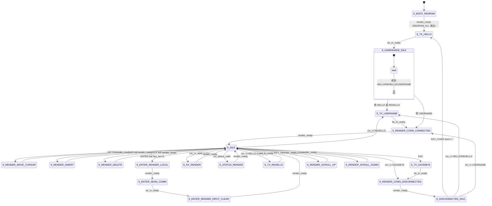

### 6.2 事件仲裁优先级 (S_IDLE)

```text
cm_status_valid  >  cm_rx_valid  >  io_key_valid
```

同 cycle 三者同时来时按上述顺序, 其余两个的 ready 不拉, 等下次轮到.

### 6.3 收到帧的反应表

|             | S_BOOT / S_HANDSHAKE                                  | S_CONNECTED (S_IDLE)                                    | S_DISCONNECTED                                       |
| ----------- | ----------------------------------------------------- | ------------------------------------------------------- | ---------------------------------------------------- |
| `HELLO`     | 比较 + 存用户名, 发 USERNAME, → S_RENDER_CONN_CONNECTED | 比较 + 存用户名, 发 REHELLO (S_TX_REHELLO), 状态不变      | 比较 + 存用户名, 发 USERNAME, → S_RENDER_CONN_CONNECTED |
| `REHELLO`   | 比较 + 存用户名, 发 USERNAME, → S_RENDER_CONN_CONNECTED | 比较 + 存用户名, 发 USERNAME (S_TX_USERNAME), 状态不变    | 比较 + 存用户名, 发 USERNAME, → S_RENDER_CONN_CONNECTED |
| `USERNAME`  | 比较 + 存用户名, → S_RENDER_CONN_CONNECTED              | 比较 + 存用户名, 状态不变                                | 比较 + 存用户名, → S_RENDER_CONN_CONNECTED            |
| `GOODBYE`   | 忽略                                                  | → S_RENDER_CONN_DISCONNECTED                            | 忽略                                                 |
| `DATA`      | 忽略                                                  | 进 S_RX_RENDER, 写 store + APPEND_REMOTE                | 忽略                                                 |

**"比较 + 存用户名"** 的语义: 与 `peer_name_q` 比较, 若不同则 `clear_en` 拉一个周期, message_store 全部 valid 清零, `wr_ptr_q` / `next_msg_id_q` 复位; 若相同则只刷新; 首次收到 (`peer_name_valid_q == 0`) 则只存不清.

**REHELLO 的角色**: HELLO 在 mid-chat 时回 USERNAME 不够 (对方不知道我已在 connected 态), 但又不能再回 HELLO (对方又给我 REHELLO, 死循环). REHELLO 是"终止索取链" — 收到 REHELLO 只回 USERNAME, 永不再发 REHELLO/HELLO.

### 6.4 按键事件反应表

| io 事件                            | S_BOOT / S_HANDSHAKE | S_CONNECTED (S_IDLE)        | S_DISCONNECTED      |
| ---------------------------------- | -------------------- | --------------------------- | ------------------- |
| `KEY_CHAR` (非空格)                | 丢弃                  | 光标处插入 (S_RENDER_INSERT) | 丢弃                |
| `KEY_CHAR` ascii=`' '`             | 丢弃                  | 当字符插入                   | → S_TX_HELLO (重连) |
| `KEY_LEFT` / `KEY_RIGHT`           | 丢弃                  | 光标移动 (S_RENDER_MOVE)     | 丢弃                |
| `KEY_BACKSPACE`                    | 丢弃                  | 光标左删 (S_RENDER_DELETE)   | 丢弃                |
| `KEY_ENTER` (line_len > 0)         | 丢弃                  | 三段流水 (LOCAL → COMM → CLR)| 丢弃                |
| `KEY_ESC`                          | 丢弃                  | 发 GOODBYE → DISCONNECTED   | 丢弃                |
| `KEY_UP` / `KEY_DOWN`              | 丢弃                  | 滚动历史 (RENDER_SCROLL_*)   | 丢弃                |

### 6.5 数据结构

```text
// 连接
conn_state_q                      // 由当前 FSM 状态隐含, 对外提供 conn_state_obs
peer_name_q   [0..MAX_NAME_LEN-1]
peer_name_len_q
peer_name_valid_q

// 输入行
line_buf      [0..MAX_LINE_LEN-1]
len_q, cursor_pos_q                // cursor_pos ∈ [0, len_q]

// 消息存储 (rtl/backend/be_message_store.sv)
message_store[i] = {valid, msg_id, side, status, len, payload}
wr_ptr_q                           // 循环写指针
next_msg_id_q                      // 单调分配的本地 msg_id
```

消息存储支持原子写 (`wr_en`), 状态-only 更新 (`upd_en` 改 PENDING → SUCCESS/FAIL), 单周期全清 (`clear_en`, 切换对端时), 以及组合 lookup (按 msg_id 找最低有效行). 切换对端时 wr_ptr / next_msg_id 一并复位.

### 6.6 三段 Enter 提交

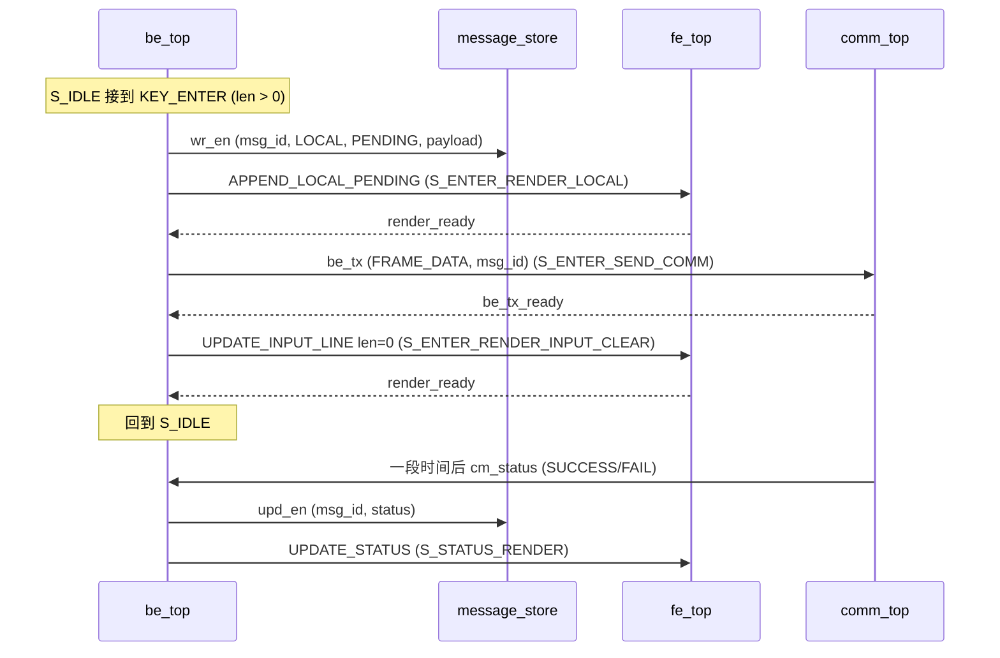

---

## 7. Frontend

`fe_top` 是双时钟域设计:

- **chat 域 (`clk`, 100 MHz)**: `fe_render_decoder` 把 backend 的渲染命令翻译成 text_ram 写入.
- **像素域 (`clk_pix`, 40 MHz)**: `fe_video_timing` 产生 (h/v counter, hsync, vsync, de); `fe_scan` 拿坐标 → 读 text_ram → 查 `fe_glyph_rom` → 输出 RGB. `fe_text_ram` 是双时钟 BRAM, 写口在 chat 域, 读口在像素域.

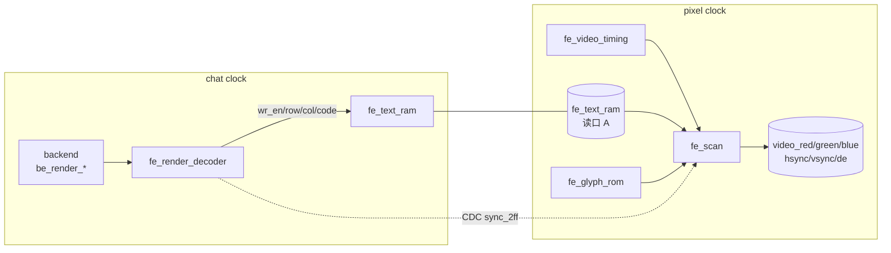

CDC: `conn_state`, `input_cursor`, `hist_wr_row`, `scroll_offset` 都是慢速控制量, 每 bit 过 `sync_2ff` 进像素域.

### 7.1 text_ram 布局 (`fe_pkg.sv`)

```text
text_ram = 128 行 × 128 列 (一个 cell = 8 bit ASCII / sprite code)

row 0                      titlebar:  "Chat with: <peer_name>"
row 1                      分隔 (空)
rows 2..65 (64 行)         history 环形缓冲 (一行 = 一条消息)
                              col 0..5     前缀 "peer: " / "me:   "
                              col 6..MAX   消息内容
                              col 71       状态 sprite (PENDING/SUCCESS/FAIL)
row 66                     分隔
row 67                     输入条:  "> <line_buf>"
```

屏幕上可见 33 行历史 (`N_HIST_VISIBLE`), 64 行环里的窗口位置由 `hist_wr_row` (写指针) + `scroll_offset` 决定. `RENDER_SCROLL_UP/DOWN` 在 fe 侧 clamp.

### 7.2 渲染命令解码器 FSM

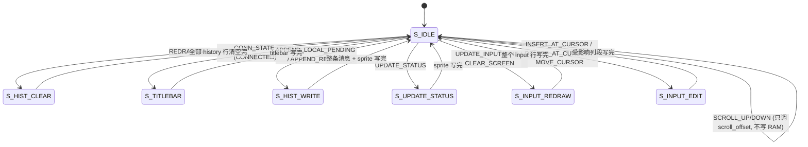

`be_render_ready` 仅在 `S_IDLE` 拉高, 多周期写入状态下 backend 自动等待.

decoder 内部维护一份 `input_line_q[]` 镜像, 这样输入行的 INSERT/DELETE 可以只重写受影响的列段, 不必每次发 UPDATE_INPUT_LINE 整行.

REDRAW_ALL 不做实质工作 (text_ram 复位为空格), 只锁存 `conn_state_curr_q`; 非 CONNECTED 时 scan 侧不读 text_ram, 直接显示 splash 图层.

### 7.3 像素 scan 流水线

`fe_scan` 流程, 每像素一拍:

1. 由 `(hdata, vdata)` 算出 `(screen_row, screen_col, gx, gy)`.
2. 把 `screen_row` 映射成 text_ram 物理行:
   - 0 → `TITLE_ROW`
   - 2..34 → history 环窗口 (按 `hist_wr_row` 和 `scroll_offset`)
   - 36 → `INPUT_ROW`
   - 1, 35 → 空白
3. 驱动 text_ram 读口; 下一拍拿到 `rd_code`.
4. 喂 `fe_glyph_rom` (8×16 字符位图 + sprite), 拿到这一行 8 像素的位图.
5. 选 `gx` 对应的 bit, 混色 (行/状态决定前景背景), 光标 cell 按 `BLINK_FRAMES` 取反.
6. 非 CONNECTED 状态用 splash 图层覆盖 (BOOT/HANDSHAKE/DISCONNECTED 三种背景色 + 居中文字).

视频时序 (`fe_video_timing`, 800×600 @ 60 Hz):

```text
H: 0..799 active, 800..839 FP, 840..967 SYNC, 968..1055 BP   pixel clock = 40 MHz
V: 0..599 active, 600..600 FP, 601..604 SYNC, 605..627 BP    HSPP=1, VSPP=1
```

### 7.4 四种屏幕

```text
boot 屏 (conn_state=BOOT):             handshake 屏:
+--------------------------------+    +--------------------------------+
|                                |    |                                |
|       Chat (booting...)        |    |     Connecting to peer...      |
|                                |    |                                |
+--------------------------------+    +--------------------------------+

connected 屏 (主聊天):                 disconnected 屏:
+--------------------------------+    +--------------------------------+
| Chat with: Bob                 |    |                                |
|--------------------------------|    |        Disconnected.           |
| me:   hello              [✓]   |    |   Press SPACE to reconnect.    |
| peer: hi                       |    |                                |
| me:   are you there?     [✗]   |    |                                |
|--------------------------------|    |                                |
| > current typing line _        |    |                                |
+--------------------------------+    +--------------------------------+
```

splash 文字储存在 fe_scan 内的小 ROM (`SPLASH_COLS=32` × 2 行), `(HSIZE − 256) / 2` 居中, 垂直居中.

---

## 8. 用户名 / 板子身份

每块 FPGA 的用户名编译期硬编码进 bitstream, 作为 `chat_top` (以及 `chat_top_board`) 的参数:

```systemverilog
parameter int MY_NAME_LEN = 5;
// 小端打包: byte 0 在 [7:0]. 默认 "Alice" = 0x41 0x6c 0x69 0x63 0x65
parameter logic [MAX_NAME_LEN*8-1:0] MY_NAME_PACKED =
    128'h00000000_00000000_00000065_63696c41;
```

B 板按 "Bob" 重新打包并跑一次 `make bitstream` 即可. 后续若要支持运行时配置, 可以把 MY_NAME 换成寄存器, 接 ROM 或拨码开关, 接口不变.

---

## 9. 仿真与综合

**Verilator 仿真**:

```bash
make                 # 跑所有 sim/tb 下的测试
make test-be_top     # 单跑一个
make font            # 重新生成 fe_font.hex
```

测试覆盖每个叶模块 + 集成 (io_be, comm_top_lb, chat_top, chat_top_pair). `chat_top_pair` 把两份 chat_top 的 UART 对接, 完整模拟两块板.

**Vivado 综合**:

```bash
make bitstream       # 调用 vivado/build.tcl
```

目标板 `xc7a200tfbg484-2` (Genesys 2). 引脚约束在 `constraints/chat_top_board.xdc`. 综合产物: `vivado/build/chat.runs/impl_1/chat_top_board.bit`.

板级顶层 `chat_top_board` 包两个 Xilinx IP: `ip_pll` (100 MHz → 40 MHz 像素时钟) 和 `ip_rgb2dvi` (RGB → TMDS 差分对). 这两个 IP 让 `chat_top_board` 不能用 Verilator elaborate, 所以仿真用 `chat_top` 直接对接 RGB / HSYNC / VSYNC / DE.

复位: `btn_rst` 是 active-high momentary push-button. `chat_top` 内部用 `sync_2ff` 做 reset 同步, 按钮按下时整条同步链拉 0, 松开后两拍后产生干净的同步释放沿.
