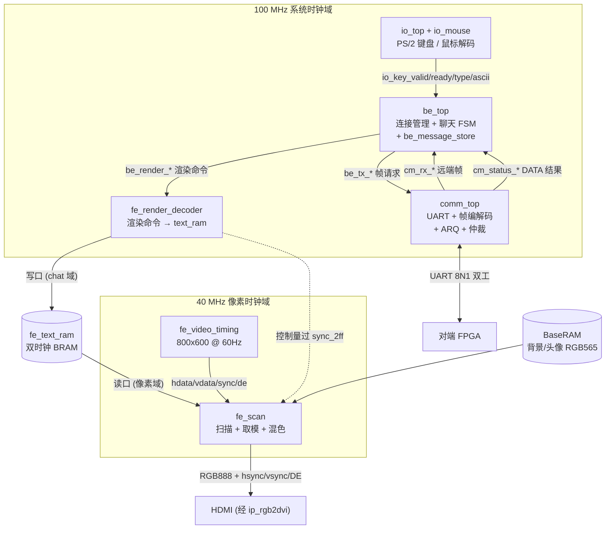
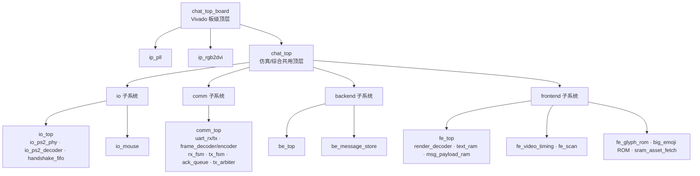
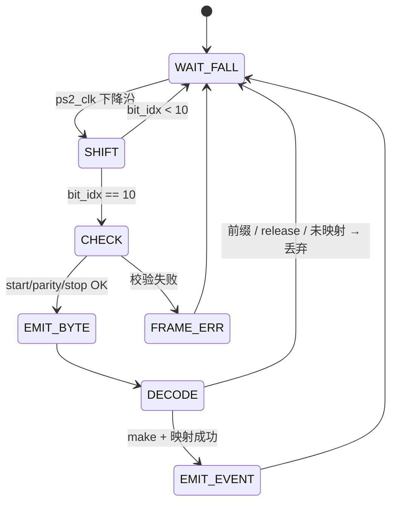
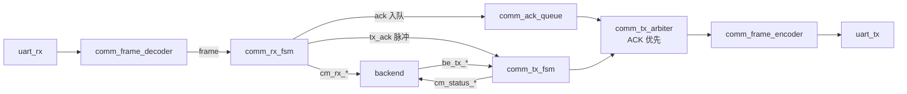
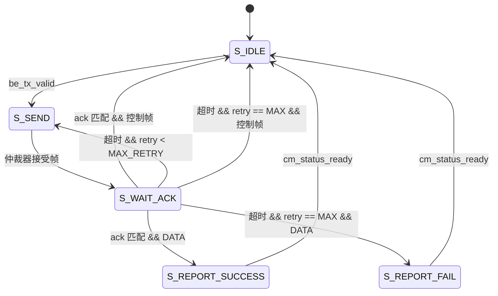
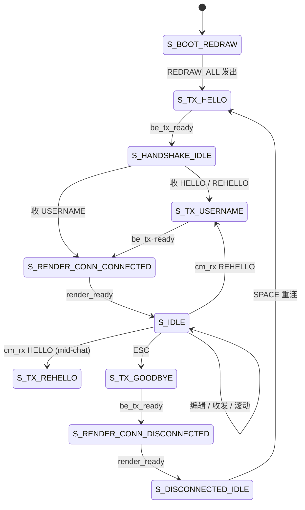
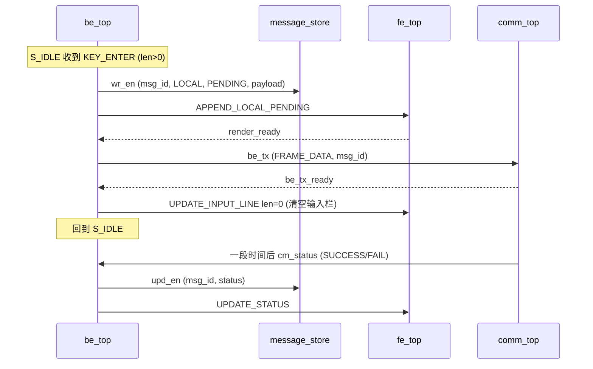
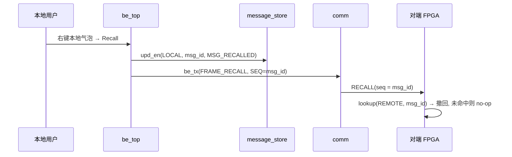
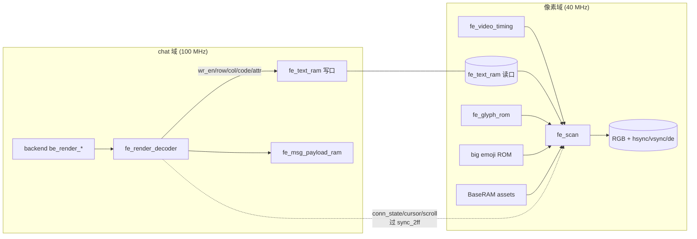
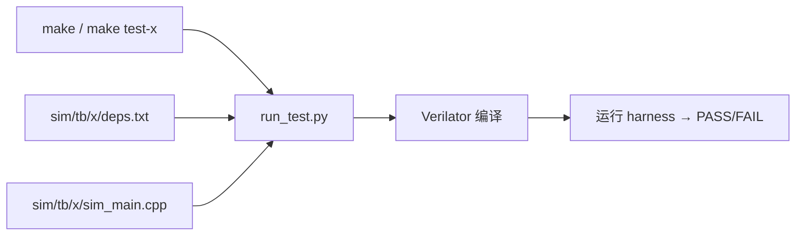

# FPGA 双端聊天系统实验报告

## 实验目的与要求

本实验的目标是在两块 FPGA 实验板之间实现一个可独立运行的一对一聊天系统。每块实验板连接 PS/2 键盘、PS/2 鼠标和 HDMI 显示器, 两块板之间通过一条 UART 双工链路交换数据。系统需要完成从输入、通信、状态管理到屏幕显示的完整闭环, 使本地用户可以输入消息、发送消息、查看远端消息, 并在链路出现重传、失败、断开或重连时得到明确的界面反馈。

实验要求不仅是完成单个 UART 收发或简单字符显示, 而是把 IO、通信协议、后端状态机和前端视频渲染组织成一个端到端系统。当前实现包含连接握手、断开与空格重连、消息发送状态回显、历史滚动、多行输入、鼠标右键菜单、引用、撤回、小表情补全、大表情贴纸、SRAM 背景与头像等功能。显示端使用 800x600 @ 60 Hz 的视频时序, 板级顶层通过 PLL 产生 40 MHz 像素时钟, 再由 rgb2dvi IP 把 RGB888、同步信号和 data enable 编码成 HDMI TMDS 差分输出。

## 实验完成情况

工程已经实现了两块 FPGA 的双端聊天功能。每块板的用户名通过 `MY_NAME_LEN` 和 `MY_NAME_PACKED` 参数在综合时写入 bitstream, 链路建立时双方通过 HELLO、REHELLO 和 USERNAME 控制帧交换身份信息。系统上电后会先显示 boot/handshake 页面, 通信端发送 HELLO 并等待对端响应; 成功交换用户名后进入 connected 主聊天界面。聊天过程中按 ESC 会发送 GOODBYE 并进入 disconnected 状态, 此时按空格可以重新发送 HELLO 发起重连。

消息发送采用业务层消息号和链路层 stop-and-wait ARQ 结合的方式。用户按 Enter 后, backend 会为本地消息分配 `msg_id`, 先写入消息存储并以 PENDING 状态渲染到屏幕, 再把 DATA 帧交给通信子系统。通信子系统收到匹配 ACK 后向 backend 回报 TX_SUCCESS, backend 再更新消息状态; 如果超过最大重传次数仍未收到 ACK, 则回报 TX_FAIL 并在界面上显示失败状态。远端 DATA 帧进入 backend 后会写入消息存储, 作为 REMOTE 消息追加到历史区。

用户交互部分已经覆盖键盘和鼠标两类输入。键盘支持普通字符、左右移动、退格、Enter、Shift+Enter 换行、ESC、Up/Down 历史滚动、Shift+Up/Shift+Down 输入框滚动以及 Ctrl+E 打开贴纸选择器。鼠标支持绝对坐标显示、滚轮、左键和右键。左键点击输入区可以移动光标, 右键点击消息气泡会打开上下文菜单, 菜单中的 Quote 会绑定引用状态, Recall 会撤回本地消息并通过 `FRAME_RECALL` 通知对端。小表情以反斜杠 token 触发候选 overlay, 点击候选后自动补齐 token; 大表情可以通过整行 token 或 Ctrl+E 贴纸选择器发送。

前端已经实现可上板的视频显示路径。`chat_top` 输出 RGB、HSYNC、VSYNC 和 DE, 供 Verilator 集成测试使用; `chat_top_board` 在外层实例化 `ip_pll` 和 `ip_rgb2dvi`, 完成真实 HDMI 输出。CONNECTED 页面中, 历史区可以读取 BaseRAM 中预先上传的 800x600 RGB565 背景, 本地和远端气泡旁可以显示 16x16 RGB565 头像。非 CONNECTED 状态下, scan 阶段不依赖 text RAM 内容, 而是显示 boot、handshake 或 disconnected splash 页面。

## 实验演示说明

演示时需要准备两块写入不同用户名 bitstream 的实验板, 并把两块板的 UART TX/RX 交叉连接。每块板连接 PS/2 键盘、PS/2 鼠标和 HDMI 显示器。上电或复位后, 屏幕先显示启动和连接提示; 两块板互相收到 HELLO/USERNAME 后进入主聊天界面, 标题栏显示对端用户名。此时任意一端输入普通文字并按 Enter, 本端会立即出现一条 pending 的本地气泡, 对端收到后显示远端气泡, 本端收到 ACK 后把状态更新为成功。

演示断开与重连时, 在 connected 状态按 ESC, 本端发送 GOODBYE 并进入 disconnected 页面, 对端收到 GOODBYE 后也进入断开状态。断开后按空格会重新发送 HELLO, 双方重新完成握手并回到 connected 状态。演示对方中途重启时, 已连接的一端收到新的 HELLO 后不会进入 HELLO 循环, 而是发送 REHELLO 并保持 connected 状态; 重启的一端收到 REHELLO 后回复 USERNAME, 双方重新收敛到已连接状态。

演示扩展交互时, 可以用 Up/Down 滚动历史, 用 Shift+Enter 输入多行消息, 用 Shift+Up/Shift+Down 滚动输入窗口。右键点击某条消息气泡会出现包含 Quote 和 Recall 的菜单。选择 Quote 后, 输入栏显示引用标记, 下一条发送的消息会携带引用前缀并在本地和对端渲染为 `> ...` 预览加正文。选择 Recall 时, 只有本地消息会被允许撤回, backend 会更新本地状态并发送 `FRAME_RECALL`; 对端收到后只撤回对应的 REMOTE 消息。输入 `\` 可以打开小表情候选, 点击候选会补全 token; 按 Ctrl+E 可以打开大表情贴纸选择器并发送彩色贴纸消息。

## 文件说明

工程的 RTL 代码集中在 `rtl/` 目录。`rtl/pkg/chat_pkg.sv` 和 `rtl/pkg/fe_pkg.sv` 是全局参数和类型的来源, 定义了消息长度、历史深度、帧类型、键盘事件类型、渲染命令、连接状态、表情 token、视频时序和界面布局等常量。`rtl/common/` 中放置 CRC16、双触发同步器、消抖和握手 FIFO 等通用模块。`rtl/io/` 中的键盘路径由 PS/2 物理层、扫描码解码器和事件 FIFO 组成, 鼠标路径由 `io_mouse` 负责 PS/2 双向初始化、坐标跟踪、滚轮和点击事件输出。

通信子系统位于 `rtl/comm/`, 包括 UART 收发器、帧编码器、帧解码器、接收 FSM、发送 FSM、ACK 队列和发送仲裁器。backend 位于 `rtl/backend/`, 其中 `be_top.sv` 是聊天系统的核心控制器, `be_message_store.sv` 管理历史消息、状态更新、查找和清空。frontend 位于 `rtl/frontend/`, 包含渲染命令解码器、文本 RAM、消息 payload RAM、视频时序、像素扫描、字模 ROM、小表情与大表情 ROM 以及 SRAM asset 读取逻辑。

顶层文件分为仿真顶层和板级顶层。`rtl/chat_top.sv` 直接连接 IO、backend、comm 和 frontend, 输出 RGB、同步和 DE 信号, 适合 Verilator elaboration 和集成测试。`rtl/chat_top_board.sv` 在 `chat_top` 外层加入 Xilinx PLL 和 rgb2dvi IP, 并连接板级 PS/2、UART、BaseRAM 和 HDMI 引脚。约束文件为 `constraints/chat_top_board.xdc`, Vivado 批处理构建脚本为 `vivado/build.tcl`, 生成的 bitstream 路径为 `vivado/build/chat.runs/impl_1/chat_top_board.bit`。

仿真代码位于 `sim/tb/`, 每个测试目录包含 C++ testbench、RTL 依赖列表和可选参数文件。脚本 `scripts/run_test.py` 用于构建并运行单个 Verilator 测试, Makefile 中的 `make` 或 `make test` 会遍历所有主要 testbench。资源生成脚本包括 `scripts/gen_font.py`、`scripts/gen_big_emoji.py` 和 `scripts/gen_sram_assets.py`, 分别用于生成字模 ROM、大表情 ROM/头文件以及 BaseRAM 背景头像二进制。

## 总体设计

系统整体按 IO、backend、comm 和 frontend 四个功能域划分。IO 子系统负责把外部 PS/2 键盘和鼠标事件转换成同步于 100 MHz 系统时钟的事件流。backend 是应用层状态机, 负责连接管理、输入编辑、消息存储、发送请求、接收处理、状态更新和 UI 行为仲裁。comm 子系统实现 UART 字节流和可靠帧传输, 屏蔽底层重传、ACK 和 CRC 校验细节。frontend 子系统负责把 backend 的抽象渲染命令转换为字符网格和像素输出, 并在像素扫描阶段叠加背景、气泡、图标、弹窗、候选列表和鼠标指针。

模块间通信遵循 valid/ready 握手。键盘事件由 `io_top` 通过 `io_key_valid/io_key_ready` 送入 backend; backend 发送帧时通过 `be_tx_valid/be_tx_ready` 把帧类型、消息号、长度和 payload 交给 comm; comm 收到远端帧后通过 `cm_rx_valid/cm_rx_ready` 通知 backend, 并通过 `cm_status_valid/cm_status_ready` 回报 DATA 发送结果。backend 到 frontend 的接口同样采用 `be_render_valid/be_render_ready`, 每条渲染命令携带命令类型、消息号、消息 side、状态、payload、光标位置和连接状态等信息。

连接管理以 HELLO、REHELLO、USERNAME 和 GOODBYE 为核心。系统复位后 backend 先发送 REDRAW_ALL, 再发送 HELLO 并进入握手等待状态。收到 HELLO 或 REHELLO 后, backend 记录对端用户名并回复 USERNAME; 收到 USERNAME 后进入 connected 状态。为了处理中途对端重启, connected 状态收到 HELLO 时不直接发送 HELLO, 而是发送 REHELLO, 对端收到 REHELLO 后只回复 USERNAME, 从而避免两端互相发送 HELLO/REHELLO 的循环。收到 GOODBYE 时进入 disconnected 状态, disconnected 状态下按空格重新发送 HELLO。

聊天消息的提交采用三段流水。按 Enter 时 backend 先把当前输入编码成 payload 并写入本地 message store, 再发送 `RENDER_APPEND_LOCAL_PENDING` 给 frontend, 让本地界面立即出现 pending 消息。随后 backend 把 DATA 帧交给 comm, 最后发送 `RENDER_UPDATE_INPUT_LINE` 清空输入栏。comm 后续回报 TX_SUCCESS 或 TX_FAIL 时, backend 只更新对应消息的状态并发送 `RENDER_UPDATE_STATUS`。远端 DATA 则在收到时写入 store, 分配历史 slot, 并发送 `RENDER_APPEND_REMOTE`。

前端显示采用字符网格和像素扫描结合的方式。`fe_render_decoder` 在 chat 时钟域把渲染命令写入 128 行、128 列的 text RAM, 其中 row 0 是标题栏, rows 2..65 是 64 行历史环, rows 67..82 是 16 行输入缓存。屏幕只显示 29 行历史和 5 行输入窗口, 滚动由 `scroll_offset` 和 `input_scroll_offset` 控制。像素域的 `fe_scan` 根据当前 h/v 坐标映射到文本单元, 读取字符码和属性, 再查字模 ROM 或大表情 ROM 输出 RGB。CONNECTED 状态下历史背景可以来自 SRAM 图片, 非 CONNECTED 状态下则直接显示 splash 图层。

## 仿真与验证说明

工程采用 Verilator 对叶模块和集成模块进行仿真。每个 testbench 目录通过 `deps.txt` 指定包和 RTL 依赖, `scripts/run_test.py` 负责调用 Verilator 编译并运行 C++ harness。Makefile 中列出的测试包括 `sync_2ff`、`handshake_fifo`、`crc16`、UART 收发、PS/2 键盘解码、IO 与 backend 集成、帧编解码、发送和接收 FSM、comm loopback、message store、backend、frontend scan、SRAM asset fetch、`fe_top`、`chat_top` 和 `chat_top_pair`。其中 `chat_top_pair` 会实例化两份 `chat_top`, 直接把两端 UART 对接, 用于模拟两块 FPGA 之间的完整聊天流程。

仿真波形由 testbench 写入 `sim/waves/` 目录, 适合检查 valid/ready 握手、UART 帧边界、ACK/重传、backend 状态迁移、render command 接收和 frontend 文本 RAM 写入等行为。由于本报告依据当前 README 和源码结构整理, 未附具体波形截图; 实际提交时可以在运行对应 testbench 后, 从 `sim/waves/*.vcd` 中截取通信帧、Enter 提交流水、状态更新或 frontend 渲染写 RAM 等典型波形补充说明。

## 复现实验步骤

复现实验时, 首先需要安装 Verilator、Python3 和 Vivado, 并确保 Vivado 可执行文件在 PATH 中。使用 `make` 可以运行全部 Verilator testbench, 使用 `make test-be_top` 这类命令可以单独运行指定模块测试。若修改字模, 运行 `make font` 重新生成 `rtl/frontend/fe_font.hex`; 若替换大表情源图, 运行 `python3 scripts/gen_big_emoji.py` 重新生成大表情 pixel ROM、palette ROM、SystemVerilog 头文件和 C++ 测试头文件。

上板前需要准备视觉素材。背景图和头像用 `scripts/gen_sram_assets.py` 打包, 生成的二进制文件从实验板控制面板写入 BaseRAM 字节地址 `0x0`。地址布局固定为 `0x000000` 放 800x600 RGB565 背景, `0x0EA600` 放 16x16 本地头像, `0x0EA800` 放 16x16 远端头像。控制面板写 SRAM 时会复位 FPGA, 写完后需要重新下载本工程 bitstream。

生成 bitstream 时运行 `make bitstream`, Makefile 会调用 `vivado/build.tcl`。该脚本会创建或复用 GUI project, 同时在 `vivado/build/` 下创建干净的 batch project, 添加 RTL、IP、字体 hex 和约束文件, 依次运行 synthesis、implementation 和 write_bitstream。默认目标器件为 `xc7a200tfbg484-2`, 顶层为 `chat_top_board`, 输出 bitstream 为 `vivado/build/chat.runs/impl_1/chat_top_board.bit`。两块板需要用不同的 `MY_NAME_LEN` 和 `MY_NAME_PACKED` 构建 bitstream, 以便连接后标题栏能显示不同用户名。

## 功能设计

### 1. 总体设计思路

整个系统围绕一个核心约束展开: 两块完全对等的 FPGA, 只靠一根串行链路通信, 却要在各自的屏幕上呈现出"同一段对话"。这意味着设计上必须同时解决三件事——把异步的人机输入整理成干净的事件流、在不可靠的串行线上做出可靠的消息投递、以及把抽象的"消息"翻译成像素。为了让这三件事互不纠缠, 我们把系统沿数据流向切成 io、backend、comm、frontend 四个功能域, 每个域只负责一层抽象的转换, 域与域之间只通过明确定义的信号束通信。

第一个贯穿全局的决定是**统一的 `valid/ready` 握手**。无论是键盘事件、发送请求、接收帧、发送状态回报, 还是渲染命令, 所有跨模块接口都遵循同一套"发送方拉 `valid`、接收方拉 `ready`、两者同高则数据成交"的协议。这样每个模块都可以在自己忙碌时自然地对上游产生反压, 而不需要任何一方去猜测对方的处理节奏。三段式的 Enter 提交、消息存储按字节流式写入 BRAM、前端渲染解码器多周期写 text_ram, 这些"慢"操作之所以能安全地插在快速的事件流里, 全靠握手提供的反压。

第二个决定是**消息驱动 / 命令驱动的架构**, 而不是让各模块直接读写共享状态。backend 不会去碰前端的显存, 而是发出 `RENDER_APPEND_LOCAL_PENDING`、`RENDER_UPDATE_STATUS` 这样的高层命令, 由 frontend 自己决定如何落到字符网格和像素上; backend 也不直接操作 UART, 而是把一个"帧请求"交给 comm, 由 comm 负责 CRC、重传、ACK 这些链路细节。这种分层让每一层的状态机都可以独立测试: 给 comm 灌帧就能验证 ARQ, 给 frontend 灌渲染命令就能验证显示, 互不依赖对方的内部实现。

第三个决定是**类型与参数集中管理**。所有跨模块的枚举、常量和位宽都定义在 `rtl/pkg/chat_pkg.sv`(系统层)和 `rtl/pkg/fe_pkg.sv`(显示层)两个 package 里, 模块内部的 FSM 状态编码则严格保持私有。消息长度、历史深度、帧类型、键盘事件类型、渲染命令、连接状态、表情 token、视频时序、界面布局这些"契约"只有一个出处, 改一处即全局生效, 这也是后面能够快速调整 `MAX_MSG_LEN` 折中编译时长的前提。

最后, 两块板的**对称性**让部署极为简单: A、B 两块板综合的是同一份 RTL, 唯一的区别是 `MY_NAME_LEN` / `MY_NAME_PACKED` 两个参数把用户名硬编码进各自的 bitstream。连接建立时双方通过 HELLO / REHELLO / USERNAME 控制帧交换身份, 因此运行时不需要任何配置, 上电握手即可显示对端用户名。

### 2. 设计原理图

`chat_top` 是仿真与综合共用的功能顶层, 它在 100 MHz 系统时钟域里实例化 io、backend、comm 以及前端的渲染解码器, 并在 40 MHz 像素时钟域里实例化视频时序和像素扫描。两个时钟域之间通过双时钟 BRAM(`fe_text_ram`)交换字符数据, 通过 `sync_2ff` 交换慢速控制量。下图给出完整的信号束与时钟域划分:



板级顶层 `chat_top_board` 在这之上只做两件硬件相关的事: 用 `ip_pll` 把 100 MHz 时钟分出 40 MHz 像素时钟, 用 `ip_rgb2dvi` 把 `chat_top` 输出的 RGB888 加同步信号编码成 HDMI 的 TMDS 差分对。正因为把这两个 Xilinx IP 留在最外层, 内部的 `chat_top` 才能被 Verilator 直接 elaborate, 做完整的集成仿真。

### 3. 模块划分

工程的模块层次与功能域一一对应。顶层之下是四个子系统, 每个子系统再拆成若干叶模块:



四个顶层子系统的职责可以概括为: **io** 把 PS/2 键鼠的异步电平整理成同步于系统时钟的事件流; **comm** 把 backend 给的"帧请求"变成线上的可靠投递, 并把对端的帧还原上送; **backend** 是唯一的应用层大脑, 持有连接状态、输入行、消息存储, 并仲裁所有事件; **frontend** 把 backend 的渲染命令落成字符网格, 再逐像素扫描成视频。下表给出关键叶模块的分工:

| 子系统   | 叶模块                              | 职责                                                       |
| -------- | ----------------------------------- | ---------------------------------------------------------- |
| io       | `io_ps2_phy`                        | 采样 PS/2 11-bit 帧, 校验后输出字节                        |
| io       | `io_ps2_decoder`                    | Set-2 扫描码 → 键盘事件, 维护 shift/ctrl/caps/前缀状态     |
| io       | `io_mouse`                          | Intellimouse 初始化, 坐标/滚轮/点击                        |
| comm     | `uart_rx` / `uart_tx`               | 8N1 串行收发                                               |
| comm     | `comm_frame_decoder` / `_encoder`   | 帧 ↔ 字节流, CRC 校验/生成                                 |
| comm     | `comm_rx_fsm` / `comm_tx_fsm`       | 接收去重 + ACK 触发; 发送 stop-and-wait ARQ               |
| comm     | `comm_ack_queue` / `comm_tx_arbiter`| ACK 缓冲; ACK 优先于数据帧的发送仲裁                       |
| backend  | `be_top`                            | 两层 FSM: 连接管理 + 聊天主循环 + UI 流程                 |
| backend  | `be_message_store`                  | 64 条消息的元数据寄存器 + payload BRAM                     |
| frontend | `fe_render_decoder`                 | 渲染命令 → text_ram / payload RAM (多周期写)              |
| frontend | `fe_scan` / `fe_video_timing`       | 视频时序 + 逐像素取模混色                                  |
| frontend | `fe_glyph_rom` / big emoji / sram   | 字模、大表情像素/调色板、SRAM 素材读取                     |

通用件(`crc16`、`sync_2ff`、`debouncer`、`handshake_fifo`)放在 `rtl/common/`, 被各子系统复用。这种"功能域 → 顶层模块 → 叶模块"的三层划分, 既让顶层连线一目了然, 也让每个叶模块都有对应的 `sim/tb/` 测试目录可以单独验证。

## 关键技术说明

### 1. IO

io 子系统要解决的本质问题是把毫无时序保证的人机输入"驯化"成系统时钟下规整的事件。键盘路径由 `io_ps2_phy`、`io_ps2_decoder` 和一个 `handshake_fifo` 串成, 鼠标路径由 `io_mouse` 独立完成。

物理层 `io_ps2_phy` 面对的是 PS/2 设备时钟(约 10–16 kHz)和数据线, 二者都是异步信号, 因此先各自过一级 `sync_2ff` 再使用。一帧 PS/2 的格式是 `start(0) | d0..d7 | parity_odd | stop(1)`, phy 在 `ps2_clk` 下降沿采样数据位, 移满 11 bit 后检查起始位、奇校验和停止位, 全部通过才脉冲一次 `byte_valid`。任何校验失败都不会抬 `byte_valid`, 坏帧因此被静默丢弃, 不会污染上层。

解码器 `io_ps2_decoder` 解释 Set-2 扫描码, 难点在于 Set-2 用前缀字节和 release 序列表达状态: `0xE0` 是扩展键前缀、`0xF0` 是断码前缀。解码器维护一组 sticky/prefix 寄存器跟踪左右 Shift、左右 Ctrl、CapsLock 以及 `seen_e0/seen_f0`, 并用一个 `prefix_timeout` 看门狗防止丢字节后前缀状态永久污染后续按键。字母键按 `shift XOR caps` 决定大小写, 其它键只看 shift。一个值得一提的技巧是**方向键的 Shift sideband**: 方向键本身没有 ASCII, 于是解码器把按键时的 Shift 状态塞进 `ev_ascii[0]`, 让 backend 用同一个 `KEY_UP/KEY_DOWN` 事件区分"历史滚动"(Shift 松)和"输入框滚动"(Shift 按)。类似地, Shift+Enter 被编码成 `KEY_CHAR` + `0x0A` 用于多行输入, Ctrl+E 被编码成 `KEY_CHAR` + `0x05` 用于打开贴纸选择器——都是在不扩展事件类型的前提下复用既有通道。

鼠标 `io_mouse` 先按表发送 Intellimouse 魔术序列 `F3 C8, F3 64, F3 50` 探测滚轮, 再用 `F2` 读设备 ID 决定 3 字节还是 4 字节包, 最后 `F4` 使能上报。之后它持续解析数据包, 维护 clamp 在 `0..799 / 0..599` 的绝对坐标, 并在按下沿输出单周期的左右键脉冲和滚轮脉冲。坐标直接交给前端画指针, 点击交给 backend 做交互。

一个把键鼠两路汇合的细节在 `io_top`: 鼠标滚轮被合成成 `KEY_UP/KEY_DOWN` 事件, 与键盘事件共用同一个 16 深 FIFO, 但键盘优先:

```systemverilog
// io_top.sv: 鼠标滚轮合成 KEY_UP/DOWN 后与键盘事件合并, 键盘优先
assign fifo_in_valid = dec_ev_valid || mouse_ev_valid;
assign fifo_in_type  = dec_ev_valid ? dec_ev_type  : mouse_ev_type;
assign fifo_in_ascii = dec_ev_valid ? dec_ev_ascii : mouse_ev_ascii;
```

由于 PS/2 按键速率(约每秒十次)远低于系统时钟, 解码器输出的是无反压的单周期脉冲, FIFO 满时直接丢弃事件, 这在工程上完全够用。io 子系统整体行为可以归纳为下面这台浅状态机:



### 2. 通信

comm 子系统在一根 UART 上叠了一层带 CRC 校验和重传的可靠帧协议。`comm_top` 把链路拆成接收和发送两条流水, 中间用一个 ACK 队列连接:



线上的帧格式是定长头 + 变长 payload + CRC 尾:

| 字段     | 宽度  | 含义                                                       |
| -------- | ----- | ---------------------------------------------------------- |
| `SOF`    | 8 bit | 固定 `0x7E` 起始字节, 不做字节填充, 靠 LEN 定边界          |
| `TYPE`   | 8 bit | bit7 = ARQ 交替位, bit2:0 = `frame_type_e`, 其余保留        |
| `SEQ`    | 8 bit | 业务层 `msg_id`(DATA 标识消息 / RECALL 标识撤回目标)       |
| `LEN`    | 16 bit| payload 字节数(LEN_HI, LEN_LO)                             |
| `PAYLOAD`| LEN B | DATA 内容 / 用户名 / 空                                    |
| `CRC16`  | 16 bit| CCITT, 校验 TYPE..PAYLOAD, 大端发送                        |

CRC 用的是标准 CCITT 参数, 集中定义在 `chat_pkg`, 校验范围是 TYPE 到 PAYLOAD(不含 SOF 与 CRC 本身):

```systemverilog
localparam logic [15:0] CRC16_POLY = 16'h1021;  // CCITT
localparam logic [15:0] CRC16_INIT = 16'hFFFF;
```

可靠性靠 **stop-and-wait 的交替位 ARQ** 实现, 关键巧思是不额外占字段, 而是借 `TYPE[7]` 作为交替位。发送 FSM 发出一帧后等待匹配的 ACK: 收到则(对 DATA)翻转交替位并向 backend 回报 `TX_SUCCESS`; 超时则重传, 直到 `MAX_RETRY=4` 次仍失败才回报 `TX_FAIL`。控制帧(HELLO/REHELLO/USERNAME/GOODBYE/RECALL)同样走重传, 但成功后既不翻转 DATA 的交替位, 也不向 backend 回报——它们是 fire-and-forget, 靠上层握手自然收敛。超时阈值 `TIMEOUT_CYCLES` 默认 `2_000_000`, 即 100 MHz 下 20 ms, 仿真时调小以缩短测试。



接收侧 `comm_rx_fsm` 对 DATA 用交替位过滤重复: 同序号的重复包只补一个 ACK 而不上送 backend, 保证幂等。控制帧则不查交替位(对方可能刚复位、序号已归零), 一律上送并补 ACK, 幂等性交给 backend 的"比较用户名"逻辑保证。CRC 错、LEN 超限、未知类型都在解码器阶段静默丢弃。发送仲裁器 `comm_tx_arbiter` 是一个纯组合的二选一: 只要 ACK 队列非空就优先合成 ACK 帧发送, 否则透传发送 FSM 的请求, 且只在帧边界切换源——这保证了 ACK 永远不会被对端的数据流堵死, 是 stop-and-wait 不死锁的关键。

### 3. 逻辑

#### (1) 状态机

backend 的 `be_top` 是整个系统唯一的应用层大脑, 用一个多状态 FSM 同时承担连接管理(外层)和聊天主循环(内层)。外层在 boot、handshake、connected、disconnected 之间迁移, 内层只在 connected(即 `S_IDLE`)时启用, 处理光标编辑、Enter 提交、远端收消息、状态更新、滚动和鼠标交互。下图给出连接与主聊天的骨架(略去多周期 helper 状态):



当 `S_IDLE` 同一周期来了多个事件时, 按 `cm_status_valid > cm_rx_valid > io_key_valid > mouse_click` 的固定优先级处理, 其余事件不拉 ready, 等下一轮。这套优先级保证发送结果和远端消息永远不会被本地打字饿死。

连接管理里最微妙的是**防 HELLO 死循环**。如果对方在通话中途重启, 它会重新发 HELLO; 已连接的一端若也回 HELLO, 对方又会回 HELLO, 形成死锁。解决办法是引入 REHELLO 作为"终止索取链"的角色: connected 态收到 HELLO 只回 REHELLO, 而收到 REHELLO 只回 USERNAME, 永不再发 HELLO/REHELLO。配套的"比较 + 存用户名"语义是: 每次收到用户名都和 `peer_name_q` 比较, 不同则拉一拍 `clear_en` 把消息存储全部清空并复位写指针(对端换人, 旧历史无意义), 相同则只刷新。

聊天主循环里最有代表性的是**三段式 Enter 提交**, 它把"立即给用户反馈"和"链路结果回报"解耦, 全程靠握手反压串起来:



除了上面这些主路径, backend 还有一批**多周期 helper 状态**, 它们存在的根本原因是要避免在一个周期里展开对 `MAX_LINE_LEN` / `MAX_MSG_LEN` 宽数据的并行操作(见后文编译时长一节): `S_LINE_INSERT` / `S_LINE_DELETE` 逐字节移动输入缓冲、`S_LINE_ENCODE` 在 Enter 前逐字节扫描把表情 token 编码成专用字节、`S_BUILD_QUOTE_DISP` 构造引用显示 payload、`S_MOUSE_CLICK` 把点击坐标换算成光标位置、`S_STICKER_*` 提交贴纸、`S_EMOJI_COMPLETE_*` 补全小表情候选、`S_RECALL_*` 处理撤回。

#### (2) 消息存储

`be_message_store` 要存最多 64 条历史消息, 每条带元数据和最长 128 字节的 payload。这里有一个关键的工程权衡: 如果把整块存储都做成寄存器, 那就是 64 × (29 bit 元数据 + 1024 bit payload), payload 部分高达 64 Kbit, 综合时会被实现成巨大的分布式 RAM 寄存器堆并配上超宽 mux, 既费 LUT 又拖慢综合。因此存储被**分成两层、用不同介质**:

```systemverilog
// 元数据: 小, 用寄存器, 组合读, 适合多读口 + lookup
//   { valid:1, msg_id:8, side:2, status:2, len:16 } × 64 = 1856 bit
logic       meta_valid [MAX_MSG_NUM];
msg_id_t    meta_msg_id[MAX_MSG_NUM];
// payload: 大, 用 BRAM, 按字节寻址, 读延迟 1 cycle
//   地址 = {slot[5:0], byte_idx[6:0]}, 共 8192 字节
byte_t      payload_bram [1 << PAYLOAD_AW];
```

元数据只有 1856 bit, 留作寄存器后可以提供两个组合读口和一个组合 lookup, 代价很低; payload 则放进一块简单双口 BRAM(Vivado 推断成几块 BRAM18), 写入时由一个内部 FSM 每周期写一个字节、用 `wr_busy` 顶住调用方, 读出时给出 `{slot, byte_idx}` 下一拍拿到字节。存储支持四种操作: 原子写整条记录(`wr_en`)、只改状态(`upd_en`, 用于 PENDING→SUCCESS/FAIL/RECALLED)、单周期全清(`clear_en`, 切换对端时)、以及按 `side + msg_id` 找最低有效行的组合 lookup。冲突策略也定得很干净——同槽 `wr_en` 压过 `upd_en`, `clear_en` 压过一切。lookup 是 quote/recall 能按消息号定位记录的基础:

```systemverilog
// 按 side + msg_id 找最低有效行 (组合)
always_comb begin
    lookup_hit = 1'b0; lookup_idx = '0;
    for (int i = 0; i < MAX_MSG_NUM; i++)
        if (!lookup_hit && meta_valid[i] &&
            meta_side[i] == lookup_side && meta_msg_id[i] == lookup_msg_id) begin
            lookup_hit = 1'b1; lookup_idx = i[IDX_W-1:0];
        end
end
```

#### (3) quote 与 recall

引用和撤回都建立在"用 `side + msg_id` 唯一定位一条消息"这个能力上, 但两者难点不同。

**引用(quote)** 的核心难点是: `msg_id` 在本地和远端是两套独立命名空间, 单凭 `msg_id` 跨板是有歧义的。解决办法是在 payload 里加一段应用层前缀, 并且**由发送方把 side 取反**, 使接收方拿到的 side 已经是"从接收方视角看"的正确值:

```text
byte 0      QUOTE_MARKER = 0x01
byte 1      quoted_side   (接收方视角: 发送方把自己看到的 LOCAL/REMOTE 取反)
byte 2      quoted_msg_id
byte 3..N   用户实际输入内容
```

之所以可以用 `0x01` 当 marker 而不会和正文冲突, 是因为输入路径只接收可打印 ASCII(`0x20..0x7E`)和换行(`0x0A`)。引用消息在线上仍然是普通 `FRAME_DATA`, 不重复携带被引用消息的全文; 本地和对端在渲染前各自用这个前缀去查自己的 `message_store`, 在 `S_BUILD_QUOTE_DISP` 状态里逐字节构造出 `> 被引用预览\n用户正文` 的显示 payload, 并能处理嵌套引用占位、已撤回占位、大表情 token 名回显等边界情况。菜单里选 Quote 只设置 backend 的引用状态、由 `be_has_quote` 让前端显示引用标记, 并不直接改写输入框。

**撤回(recall)** 的难点是它没有应用层 ACK, 是 best-effort 的 UI 事件, 因此语义必须设计得即使丢失也不会让两端状态发散。规则是: 只允许撤回本地消息; backend 先把本机的 `LOCAL + msg_id` 记录更新为 `MSG_RECALLED`, 再发一帧 `FRAME_RECALL`(目标消息号放在 `SEQ`、payload 为空); 对端收到后只查找并撤回自己的 `REMOTE + msg_id`, 找不到就 no-op。这样即使 RECALL 帧最终没送达, 也只是对端少撤回一条, 不会出现"撤回了不该撤的消息"。



### 4. 显示

#### (1) 渲染 pipeline

frontend 是一个**双时钟域**设计: chat 域(100 MHz)负责"把命令写进字符网格", 像素域(40 MHz)负责"把字符网格扫成视频", 两者通过双时钟 BRAM 和 `sync_2ff` 解耦。



在 chat 域, `fe_render_decoder` 把 backend 的高层命令翻译成对 128×128 字符 RAM 的写入。这块 RAM 的物理布局是固定的: row 0 是标题栏, rows 2..65 是 64 行历史环形缓冲(一条多行消息会占多个物理行), rows 67..82 是 16 行多行输入缓存。解码器是一个多周期 FSM, 只在 `S_IDLE` 拉高 `be_render_ready`, 写入/解析期间让 backend 自然等待; 它内部还维护一份 `input_line_q[]` 镜像, INSERT/DELETE 和换行解析都按字节多周期执行(同样是为了避免综合时展开大循环)。

在像素域, `fe_scan` 每像素一拍地工作: 由视频时序给出的 `(hdata, vdata)` 算出屏幕行列, 把屏幕行映射到 text_ram 物理行(标题、29 行历史窗口、5 行输入窗口或空白分隔), 驱动 text_ram 读口, 下一拍拿到字符码后查字模 ROM 或大表情 ROM, 选出当前像素对应的 bit/nibble, 再根据气泡属性、消息状态、overlay 决定前景背景做混色, 光标 cell 还会按 `BLINK_FRAMES` 周期取反。整条流水线深度为 1(text_ram 是那一级寄存器), 所有同步/DE/坐标信号都延迟一拍与 `rd_code` 对齐。屏幕上只显示 29 行历史和 5 行输入, 窗口位置由 `hist_wr_row + scroll_offset` 和 `input_scroll_offset` 决定, 所有滚动都在像素侧 clamp。非 CONNECTED 状态下 scan 不读 text_ram, 直接显示 boot/handshake/disconnected 的 splash 图层; CONNECTED 状态下再在历史背景之上叠加气泡、弹窗、小表情候选和鼠标指针。视频时序本身是标准的 800×600 @ 60 Hz(像素时钟 40 MHz)。

#### (2) Big Emoji

大表情贴纸要在以字符为单位的网格里画出 48×48 的彩色图。做法是给大表情分配 `0x80` 起的一段 tile 码: 用户输入的整行 `\Name` token 只在"整行恰好等于该 token 且无引用状态"时被 backend 编码成**单个 anchor 字节**, 前端再把这个 anchor 在 text_ram 里展开成 3×6 个字符 cell(每 cell 8×16 像素, 合成 48×48)。每个 tile 的像素来自 `fe_big_emoji_pixel_rom`(4 bpp), nibble 作为索引查 `fe_big_emoji_palette_rom` 得到真彩色, 调色板 idx 0 约定为透明/气泡背景。这样大表情既能塞进字符网格的寻址体系, 又能显示彩色。所有这些 ROM 和配套的码表头文件都由 `scripts/gen_big_emoji.py` 从 `assets/big_emoji/*` 一键生成, 同时产出 RTL 端的 `.hex`/`.svh` 和 C++ 测试端的头文件, 保证三方码点一致。当前内置 `\Heartbroken \Hissing \Shrug \Sweat \Xiucai` 五个。Ctrl+E 打开贴纸选择器, 无引用时点击直接提交一条单贴纸消息, 有引用时则把 `\Name` 当普通文字插入, 让引用仍走普通 DATA 格式。

#### (3) 背景与头像

背景和头像有意**不进入 bitstream**。原因很实际: 一张 800×600 的背景就接近 1 MB, 如果做成片上 ROM 或 `$readmemh` 初始化的 RAM, 综合会试图构造接近 1 MB 的片上存储, 编译极慢甚至失败。因此这些素材改放在实验板的 4 MB BaseRAM 里, 作为只读视觉素材区。素材用 `scripts/gen_sram_assets.py` 打包成 RGB565 little-endian 的 raw binary, 通过控制面板写入固定地址布局:

| 字节地址  | 内容                                     |
| --------- | ---------------------------------------- |
| `0x000000`| 800×600 RGB565 背景, 960000 字节         |
| `0x0EA600`| 16×16 RGB565 本地头像, 512 字节          |
| `0x0EA800`| 16×16 RGB565 远端头像, 512 字节          |

前端在 CONNECTED 页面通过 `fe_sram_asset_fetch` 按当前像素坐标算出 SRAM 地址、读回 RGB565 像素: 历史区背景用上传的壁纸, 远端气泡左侧和本地气泡右侧贴对应头像, 标题栏和输入栏仍保留固定配色以保证可读。这条 SRAM 通路用参数 `ENABLE_SRAM_ASSETS` 控制——板级顶层 `chat_top_board` 打开它, 仿真顶层默认关闭, 这样 Verilator 不依赖任何外部 SRAM 内容也能跑完整集成测试。替换壁纸或头像时只需重新生成并写入这份 SRAM 文件, bitstream 读取同一套地址布局即可。

## 实验中遇到的问题及解决方法

### 1. 编译时长: 状态机/寄存器堆过大导致 elaboration 爆炸

工程早期(对应内部 P2 阶段)曾把 `MAX_MSG_LEN = MAX_LINE_LEN` 调到 640 以支持长消息, 结果 Vivado 2019.2 在 Artix-7 200T 上 `synth_design` 的 RTL elaboration 阶段从原来的约 3 秒暴涨到约 4 分钟, 内存峰值达到 23 GB, 综合后还塞了大量 LUT 去实现分布式 RAM 寄存器堆和超宽 mux, 时序也很紧。

定位后发现根因有两类。其一是 **Vivado 会把 `for (i = 0; i < <const>; i++)` 这类过程循环在 elaboration 阶段完全展开**成 `<const>` 份显式 mux 和常量传播, 代价随上界近似平方增长。工程里有四处这样的大循环都直接被 `MAX_MSG_LEN` / `MAX_LINE_LEN` 驱动: `KEY_CHAR` 在光标处插入字符的并行右移、`KEY_BACKSPACE` 的并行左移、前端 `fe_render_decoder` 中镜像的 INSERT/DELETE 移位, 以及三处按 payload 找换行的解析循环。其二是 **`slot_payload_q` 这种 64 × 数 Kbit 的寄存器堆**配上超宽动态 bit-slice, 虽然不直接吃 elab 时间, 却是 LUT 大户并恶化时序。

我们把分析过程和两条优化路径完整记录在了 `docs/synthesis_perf.md`, 最终采取的组合方案是:

第一, 把 `MAX_MSG_LEN` 回退到 128 作为"够用且编译够快"的上板折中。由于消息长度是 `chat_pkg` 里的单一常量、且帧格式本来就用 16-bit LEN, 这是一行改动, 把每次 unroll 的步数缩到原来的 1/5。

第二, 把消息 payload 从寄存器堆**搬进 BRAM**(对应 "rewrite in bram" 的改动)。`be_message_store` 因此被拆成"元数据寄存器 + payload BRAM"两层, payload 改为按字节流式写入、单口读出 1 拍延迟; 前端也新增 `fe_msg_payload_ram` 承接历史消息正文。这消掉了分布式 RAM 寄存器堆和与之配套的超宽 mux, 既省 LUT 又改善时序。

第三, 把那几处**并行宽操作改写成多周期 FSM**。backend 的字符插入/删除变成 `S_LINE_INSERT` / `S_LINE_DELETE` 每周期搬一个字节, 换行解析也改成逐字节扫描的多周期状态。这样综合里不再有按大常量展开的 unroll, elaboration 回到可接受的量级。代价只是"打字"和"提交"多了几百纳秒延迟, 而用户键盘节奏是毫秒级的, 完全感知不到。

### 2. Vivado GUI 有状态、仿真不便: 引入脚本级的构建 + 测试系统

用 Vivado GUI 工程做开发还暴露出两个工程化痛点。一是 **GUI 工程是有状态的**: 添加/删除文件、改综合设置都会沉淀进 `.xpr` 和一堆运行目录, 时间一长很难说清"当前 bitstream 到底是哪份源码、哪套设置综合出来的", 也难以在另一台机器上一键复现。二是 **Vivado 自带仿真又慢又不便于做细粒度的单元测试和回归**, 每改一个叶模块都走 GUI 仿真的代价太高。

解决办法是把"构建"和"测试"都脚本化、去状态化。仿真侧改用 Verilator: 每个模块在 `sim/tb/<name>/` 下放一个 C++ testbench 和一个 `deps.txt`(声明该测试需要的 package 和 RTL 依赖), 由 `scripts/run_test.py` 读依赖、调 Verilator 编译并运行 harness, 顶层 `Makefile` 的 `make` 会遍历所有 testbench 给出 PASS/FAIL 汇总, `make test-<name>` 可单跑一个并打印实时日志。



测试覆盖从叶模块(`sync_2ff`、`crc16`、UART 收发、PS/2 解码、帧编解码、收发 FSM、message store……)一直到集成(`io_be_integration`、`comm_top_lb` loopback、`fe_top`、`chat_top`), 其中 `chat_top_pair` 直接把两份 `chat_top` 的 UART 对接, 完整模拟两块板之间的握手、收发、断连重连流程, 让"两块板"的行为在提交前就能在一台机器上回归。

综合侧则用 `make bitstream` 调用批处理脚本 `vivado/build.tcl`: 它在 `vivado/build/` 下创建一个干净的 batch project, 程序化地添加 RTL、IP、字模 hex 和约束, 依次跑 synthesis / implementation / write_bitstream, 产出固定路径的 `chat_top_board.bit`。整个过程不依赖任何 GUI 状态, 从源码到 bitstream 完全可复现, 也便于切换 `MY_NAME_*` 参数分别为 A、B 两块板出不同的 bitstream。
